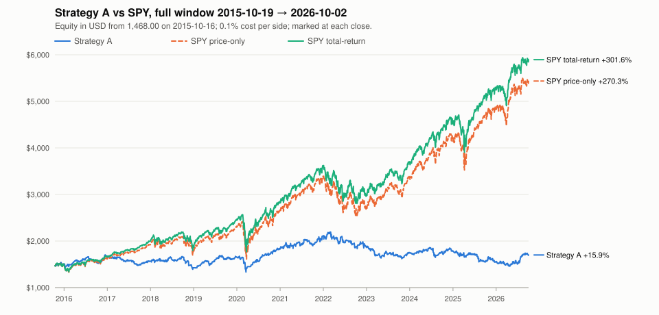

# Strategy A backtest, data through 2026-10-02

**Gate verdict:** Strategy A fails the P3 gate: out of sample it returned −15.0% against +71.9% for total-return SPY, with profit factor 0.92 and max drawdown 33.3%, so it fails on beating total-return SPY, profit factor ≥ 1.3 and max drawdown ≤ 15%; P4 must not start until Strategy A is reworked.

## Data

- Data end (last bar loaded): 2026-10-02
- Bar rows loaded: 1,817,429
- Symbols with bars: 663
- Index members in the window with no bars at all: 115

| Window | Dates | Sessions | USD/IDR at start | Starting cash (USD) |
|:---|:---|---:|---:|---:|
| In-sample | 2015-10-19 → 2021-12-31 | 1,563 | 13,624.0000 | 1,468.00 |
| Out-of-sample | 2022-01-03 → 2026-10-02 | 1,192 | 14,269.0000 | 1,401.64 |
| Full window | 2015-10-19 → 2026-10-02 | 2,755 | 13,624.0000 | 1,468.00 |

## Method

- **Strategy A** (design §4): a setup needs close > SMA(200), Wilder RSI(2) < `rsi_max` and 20-session mean close × volume > `min_dollar_volume` (design: RSI < 10, $20000000). Limit = close − `limit_atr` × ATR(14), TP = limit + `tp_atr` × ATR(14), SL = limit − `sl_atr` × ATR(14), each to 4 dp. Candidates are ranked by RSI(2) ascending, with the symbol breaking ties.
- **No look-ahead.** Picks for session S use bars through the previous session only. The universe is S&P 500 ∪ Nasdaq-100 members on that data date (point in time).
- **One simulator.** Every size, fill, exit and cost (0.1% per side, whole shares, 4 slots) comes from `seer_engine.sim`, unchanged. Each window is a fresh portfolio of 20,000,000 IDR converted at the start date's USD/IDR rate. A held symbol whose bars end for good is closed at its last close (a forced `time` exit).
- **SPY benchmarks.** Buy whole shares at the first session's open after the 0.1% cost, hold, and mark at each close. Price-only ignores dividends. Total-return reinvests each dividend at the ex-date close (whole shares, with cost). At the end of a window, open positions and the SPY holding are both marked at the last close and never sold.
- **Metrics** follow `web/lib/metrics.ts`:
  - Total return = last / first equity − 1. Every curve starts at the starting cash on the session before the window.
  - A win is P/L > 0 and a loss is P/L ≤ 0. Profit factor = gross win / gross loss (∞ with no loss).
  - Max drawdown is measured on per-session equity. Months = calendar days / 30.44.
  - CAGR = (last / first)^(1 / years) − 1, with years = calendar days between the first and last snapshot / 365.25 (Actual/365.25).
  - Avg days held is the mean of the simulator's `days_held` over closed trades.
- **Tuning.** The grid is RSI {5, 10, 15} × limit {0.25, 0.5, 0.75} × TP {0.75, 1.0, 1.5} × SL {1.0, 1.5, 2.0} ATR, and it runs on the in-sample window only.
  - Selection takes the highest in-sample total return among runs with max drawdown ≤ 15% and profit factor ≥ 1.3. Ties go to the lower max drawdown, then to grid order. If no run qualifies, the design values are kept.
  - The out-of-sample window runs once, with the selected parameters, and its numbers never feed back into the selection.
- **Gate.** Passes only if, out of sample, total return > total-return SPY, profit factor ≥ 1.3 and max drawdown ≤ 15%. In-sample numbers never decide it.

## In-sample grid (81 runs, 2015-10-19 → 2021-12-31)

Every grid run, in grid order, on the in-sample window. A run qualifies when max drawdown ≤ 15% and profit factor ≥ 1.3. Selection reads these numbers and nothing else.

| # | RSI(2) < | Limit ×ATR | TP ×ATR | SL ×ATR | Total return | CAGR | Win rate | Profit factor | Max drawdown | Trades | Qualifies | Selected |
|---:|---:|---:|---:|---:|---:|---:|---:|---:|---:|---:|:---|:---|
| 1 | 5 | 0.25 | 0.75 | 1 | −14.5% | −2.5% | 56.3% | 0.95 | 45.6% | 1326 | no |  |
| 2 | 5 | 0.25 | 0.75 | 1.5 | +8.5% | +1.3% | 61.3% | 1.03 | 35.7% | 1213 | no |  |
| 3 | 5 | 0.25 | 0.75 | 2 | +22.0% | +3.2% | 64.8% | 1.08 | 31.3% | 1135 | no |  |
| 4 | 5 | 0.25 | 1 | 1 | +10.9% | +1.7% | 52.7% | 1.04 | 40.7% | 1238 | no |  |
| 5 | 5 | 0.25 | 1 | 1.5 | +23.3% | +3.4% | 57.2% | 1.08 | 28.9% | 1125 | no |  |
| 6 | 5 | 0.25 | 1 | 2 | +67.1% | +8.6% | 61.4% | 1.22 | 22.9% | 1057 | no |  |
| 7 | 5 | 0.25 | 1.5 | 1 | +15.3% | +2.3% | 47.7% | 1.06 | 38.8% | 1099 | no |  |
| 8 | 5 | 0.25 | 1.5 | 1.5 | +9.9% | +1.5% | 50.8% | 1.03 | 26.8% | 1003 | no |  |
| 9 | 5 | 0.25 | 1.5 | 2 | +28.2% | +4.1% | 54.7% | 1.10 | 23.9% | 942 | no |  |
| 10 | 5 | 0.5 | 0.75 | 1 | +36.2% | +5.1% | 58.8% | 1.15 | 24.4% | 1046 | no |  |
| 11 | 5 | 0.5 | 0.75 | 1.5 | +52.0% | +7.0% | 64.7% | 1.23 | 17.0% | 960 | no |  |
| 12 | 5 | 0.5 | 0.75 | 2 | +49.8% | +6.7% | 66.3% | 1.23 | 18.3% | 916 | no |  |
| 13 | 5 | 0.5 | 1 | 1 | +31.2% | +4.5% | 53.5% | 1.13 | 23.0% | 991 | no |  |
| 14 | 5 | 0.5 | 1 | 1.5 | +50.8% | +6.8% | 59.0% | 1.21 | 17.0% | 903 | no |  |
| 15 | 5 | 0.5 | 1 | 2 | +51.7% | +6.9% | 61.5% | 1.22 | 18.3% | 859 | no |  |
| 16 | 5 | 0.5 | 1.5 | 1 | +30.2% | +4.3% | 47.7% | 1.13 | 25.2% | 891 | no |  |
| 17 | 5 | 0.5 | 1.5 | 1.5 | +52.2% | +7.0% | 52.3% | 1.22 | 18.4% | 809 | no |  |
| 18 | 5 | 0.5 | 1.5 | 2 | +54.9% | +7.3% | 55.3% | 1.24 | 21.9% | 780 | no |  |
| 19 | 5 | 0.75 | 0.75 | 1 | −8.5% | −1.4% | 56.2% | 0.95 | 17.5% | 740 | no |  |
| 20 | 5 | 0.75 | 0.75 | 1.5 | +12.2% | +1.9% | 63.2% | 1.07 | 15.4% | 704 | no |  |
| 21 | 5 | 0.75 | 0.75 | 2 | −0.8% | −0.1% | 64.3% | 1.00 | 22.4% | 669 | no |  |
| 22 | 5 | 0.75 | 1 | 1 | +18.9% | +2.8% | 53.1% | 1.10 | 13.6% | 716 | no |  |
| 23 | 5 | 0.75 | 1 | 1.5 | +38.4% | +5.4% | 59.1% | 1.21 | 13.9% | 672 | no |  |
| 24 | 5 | 0.75 | 1 | 2 | +34.2% | +4.9% | 61.3% | 1.19 | 13.9% | 641 | no |  |
| 25 | 5 | 0.75 | 1.5 | 1 | +23.4% | +3.4% | 47.6% | 1.13 | 19.0% | 675 | no |  |
| 26 | 5 | 0.75 | 1.5 | 1.5 | +34.2% | +4.8% | 52.4% | 1.18 | 14.9% | 632 | no |  |
| 27 | 5 | 0.75 | 1.5 | 2 | +21.4% | +3.2% | 54.0% | 1.12 | 21.6% | 600 | no |  |
| 28 | 10 | 0.25 | 0.75 | 1 | −4.8% | −0.8% | 57.5% | 0.99 | 43.7% | 1545 | no |  |
| 29 | 10 | 0.25 | 0.75 | 1.5 | +2.8% | +0.4% | 61.4% | 1.01 | 36.8% | 1393 | no |  |
| 30 | 10 | 0.25 | 0.75 | 2 | +24.0% | +3.5% | 64.3% | 1.07 | 29.3% | 1308 | no |  |
| 31 | 10 | 0.25 | 1 | 1 | +31.0% | +4.4% | 53.9% | 1.08 | 35.4% | 1429 | no |  |
| 32 | 10 | 0.25 | 1 | 1.5 | +25.5% | +3.7% | 57.5% | 1.07 | 29.4% | 1281 | no |  |
| 33 | 10 | 0.25 | 1 | 2 | +59.7% | +7.8% | 61.1% | 1.15 | 29.0% | 1199 | no |  |
| 34 | 10 | 0.25 | 1.5 | 1 | +2.1% | +0.3% | 46.7% | 1.01 | 46.6% | 1242 | no |  |
| 35 | 10 | 0.25 | 1.5 | 1.5 | +13.9% | +2.1% | 50.8% | 1.04 | 31.4% | 1127 | no |  |
| 36 | 10 | 0.25 | 1.5 | 2 | +26.8% | +3.9% | 53.8% | 1.08 | 27.1% | 1062 | no |  |
| 37 | 10 | 0.5 | 0.75 | 1 | +24.8% | +3.6% | 58.6% | 1.09 | 35.2% | 1226 | no |  |
| 38 | 10 | 0.5 | 0.75 | 1.5 | +61.5% | +8.0% | 65.8% | 1.21 | 20.1% | 1132 | no |  |
| 39 | 10 | 0.5 | 0.75 | 2 | +58.7% | +7.7% | 67.7% | 1.21 | 21.0% | 1075 | no |  |
| 40 | 10 | 0.5 | 1 | 1 | +12.2% | +1.9% | 53.0% | 1.04 | 34.3% | 1141 | no |  |
| 41 | 10 | 0.5 | 1 | 1.5 | +43.6% | +6.0% | 59.6% | 1.15 | 21.7% | 1042 | no | kept (fallback) |
| 42 | 10 | 0.5 | 1 | 2 | +57.8% | +7.6% | 62.2% | 1.19 | 22.8% | 994 | no |  |
| 43 | 10 | 0.5 | 1.5 | 1 | +17.9% | +2.7% | 47.4% | 1.06 | 33.9% | 1018 | no |  |
| 44 | 10 | 0.5 | 1.5 | 1.5 | +51.0% | +6.9% | 53.6% | 1.17 | 22.8% | 926 | no |  |
| 45 | 10 | 0.5 | 1.5 | 2 | +48.4% | +6.6% | 55.9% | 1.17 | 23.8% | 892 | no |  |
| 46 | 10 | 0.75 | 0.75 | 1 | +3.4% | +0.5% | 58.9% | 1.02 | 23.7% | 886 | no |  |
| 47 | 10 | 0.75 | 0.75 | 1.5 | +10.8% | +1.7% | 64.7% | 1.05 | 23.9% | 841 | no |  |
| 48 | 10 | 0.75 | 0.75 | 2 | +0.3% | +0.0% | 66.1% | 1.00 | 25.1% | 800 | no |  |
| 49 | 10 | 0.75 | 1 | 1 | +28.0% | +4.1% | 55.5% | 1.12 | 20.4% | 849 | no |  |
| 50 | 10 | 0.75 | 1 | 1.5 | +38.6% | +5.4% | 61.0% | 1.16 | 20.7% | 799 | no |  |
| 51 | 10 | 0.75 | 1 | 2 | +25.4% | +3.7% | 63.1% | 1.11 | 24.8% | 757 | no |  |
| 52 | 10 | 0.75 | 1.5 | 1 | +30.4% | +4.4% | 48.9% | 1.13 | 21.5% | 787 | no |  |
| 53 | 10 | 0.75 | 1.5 | 1.5 | +26.2% | +3.8% | 53.0% | 1.12 | 25.1% | 734 | no |  |
| 54 | 10 | 0.75 | 1.5 | 2 | +16.8% | +2.5% | 54.9% | 1.08 | 25.9% | 701 | no |  |
| 55 | 15 | 0.25 | 0.75 | 1 | −2.7% | −0.4% | 57.5% | 0.99 | 43.1% | 1619 | no |  |
| 56 | 15 | 0.25 | 0.75 | 1.5 | +0.0% | +0.0% | 60.7% | 1.00 | 39.5% | 1440 | no |  |
| 57 | 15 | 0.25 | 0.75 | 2 | +11.1% | +1.7% | 63.3% | 1.03 | 37.3% | 1350 | no |  |
| 58 | 15 | 0.25 | 1 | 1 | +33.0% | +4.7% | 53.6% | 1.08 | 38.1% | 1486 | no |  |
| 59 | 15 | 0.25 | 1 | 1.5 | +22.4% | +3.3% | 57.2% | 1.06 | 34.8% | 1331 | no |  |
| 60 | 15 | 0.25 | 1 | 2 | +39.0% | +5.4% | 60.5% | 1.11 | 35.5% | 1242 | no |  |
| 61 | 15 | 0.25 | 1.5 | 1 | +20.3% | +3.0% | 47.5% | 1.06 | 43.1% | 1285 | no |  |
| 62 | 15 | 0.25 | 1.5 | 1.5 | +13.4% | +2.0% | 50.6% | 1.04 | 31.4% | 1168 | no |  |
| 63 | 15 | 0.25 | 1.5 | 2 | +28.5% | +4.1% | 54.0% | 1.08 | 28.5% | 1099 | no |  |
| 64 | 15 | 0.5 | 0.75 | 1 | +27.9% | +4.0% | 58.5% | 1.09 | 35.1% | 1297 | no |  |
| 65 | 15 | 0.5 | 0.75 | 1.5 | +51.7% | +6.9% | 64.9% | 1.16 | 28.0% | 1196 | no |  |
| 66 | 15 | 0.5 | 0.75 | 2 | +59.1% | +7.8% | 66.8% | 1.19 | 22.8% | 1126 | no |  |
| 67 | 15 | 0.5 | 1 | 1 | +7.1% | +1.1% | 52.9% | 1.02 | 35.3% | 1206 | no |  |
| 68 | 15 | 0.5 | 1 | 1.5 | +44.1% | +6.1% | 58.9% | 1.14 | 24.4% | 1100 | no |  |
| 69 | 15 | 0.5 | 1 | 2 | +54.6% | +7.3% | 61.5% | 1.17 | 22.6% | 1043 | no |  |
| 70 | 15 | 0.5 | 1.5 | 1 | +29.1% | +4.2% | 47.6% | 1.09 | 35.3% | 1085 | no |  |
| 71 | 15 | 0.5 | 1.5 | 1.5 | +75.0% | +9.4% | 53.6% | 1.23 | 23.5% | 988 | no |  |
| 72 | 15 | 0.5 | 1.5 | 2 | +70.8% | +9.0% | 55.6% | 1.23 | 21.1% | 939 | no |  |
| 73 | 15 | 0.75 | 0.75 | 1 | −2.1% | −0.3% | 58.4% | 0.99 | 27.8% | 941 | no |  |
| 74 | 15 | 0.75 | 0.75 | 1.5 | +6.9% | +1.1% | 64.2% | 1.03 | 23.2% | 881 | no |  |
| 75 | 15 | 0.75 | 0.75 | 2 | +6.9% | +1.1% | 66.1% | 1.03 | 24.3% | 844 | no |  |
| 76 | 15 | 0.75 | 1 | 1 | +22.7% | +3.3% | 55.0% | 1.09 | 22.7% | 901 | no |  |
| 77 | 15 | 0.75 | 1 | 1.5 | +29.3% | +4.2% | 60.4% | 1.12 | 20.1% | 840 | no |  |
| 78 | 15 | 0.75 | 1 | 2 | +26.1% | +3.8% | 62.5% | 1.11 | 23.6% | 793 | no |  |
| 79 | 15 | 0.75 | 1.5 | 1 | +31.3% | +4.5% | 48.9% | 1.12 | 24.8% | 831 | no |  |
| 80 | 15 | 0.75 | 1.5 | 1.5 | +29.8% | +4.3% | 53.3% | 1.12 | 21.1% | 773 | no |  |
| 81 | 15 | 0.75 | 1.5 | 2 | +26.4% | +3.8% | 55.6% | 1.11 | 24.1% | 734 | no |  |

## Selection

No in-sample grid run had max drawdown ≤ 15% and profit factor ≥ 1.3 (0 of 81), so the design values are kept.

| Parameter | Design | Selected | Frozen in code |
|:---|---:|---:|---:|
| rsi_max | 10 | 10 | 10 |
| limit_atr | 0.5 | 0.5 | 0.5 |
| tp_atr | 1 | 1 | 1 |
| sl_atr | 1.5 | 1.5 | 1.5 |
| min_dollar_volume | 20000000 | 20000000 | 20000000 |

Frozen in code (`STRATEGY_A_PARAMS`): matches the selection.

```text
frozen-params: {"rsi_max": "10", "limit_atr": "0.5", "tp_atr": "1", "sl_atr": "1.5", "min_dollar_volume": "20000000"}
selected-params: {"rsi_max": "10", "limit_atr": "0.5", "tp_atr": "1", "sl_atr": "1.5", "min_dollar_volume": "20000000"}
```

## Results

In-sample shows the tuned parameters on the data they were tuned on, which is not evidence. Out-of-sample is the honest test. The full window is one continuous portfolio over both.

### In-sample (2015-10-19 → 2021-12-31, 1,563 sessions)

| Metric | Strategy A | SPY price-only | SPY total-return |
|:---|---:|---:|---:|
| Ending equity (USD) | 2,108.03 | 3,373.80 | 3,602.55 |
| Total return | +43.6% | +129.8% | +145.4% |
| CAGR | +6.0% | +14.3% | +15.6% |
| Win rate | 59.6% | — | — |
| Profit factor | 1.15 | — | — |
| Max drawdown | 21.7% | 33.4% | 31.1% |
| Trades (closed) | 1042 | — | — |
| Avg days held | 3.28 | — | — |
| Exits: take profit | 515 | — | — |
| Exits: stop loss | 202 | — | — |
| Exits: time stop | 265 | — | — |
| Exits: gap at the open | 60 | — | — |
| Forced closes (bars ended; inside time stop) | 0 | — | — |
| Open at end | 0 | — | — |
| Months | 74.5 | 74.5 | 74.5 |
| SPY shares at end | — | 7 | 7 |
| SPY dividends credited (USD) | — | — | 228.75 |

Picks the simulator rejected: held 1,147, lt_one_share 103, no_slot 32,169.

### Out-of-sample (2022-01-03 → 2026-10-02, 1,192 sessions)

| Metric | Strategy A | SPY price-only | SPY total-return |
|:---|---:|---:|---:|
| Ending equity (USD) | 1,191.37 | 1,987.37 | 2,409.35 |
| Total return | −15.0% | +41.8% | +71.9% |
| CAGR | −3.4% | +7.6% | +12.1% |
| Win rate | 53.8% | — | — |
| Profit factor | 0.92 | — | — |
| Max drawdown | 33.3% | 17.3% | 22.7% |
| Trades (closed) | 782 | — | — |
| Avg days held | 3.49 | — | — |
| Exits: take profit | 342 | — | — |
| Exits: stop loss | 176 | — | — |
| Exits: time stop | 226 | — | — |
| Exits: gap at the open | 38 | — | — |
| Forced closes (bars ended; inside time stop) | 0 | — | — |
| Open at end | 2 | — | — |
| Months | 57.0 | 57.0 | 57.0 |
| SPY shares at end | — | 2 | 3 |
| SPY dividends credited (USD) | — | — | 97.30 |

Picks the simulator rejected: held 965, lt_one_share 642, no_slot 26,510.

### Full window (2015-10-19 → 2026-10-02, 2,755 sessions)

| Metric | Strategy A | SPY price-only | SPY total-return |
|:---|---:|---:|---:|
| Ending equity (USD) | 1,701.45 | 5,436.56 | 5,895.54 |
| Total return | +15.9% | +270.3% | +301.6% |
| CAGR | +1.4% | +12.7% | +13.5% |
| Win rate | 57.2% | — | — |
| Profit factor | 1.03 | — | — |
| Max drawdown | 33.4% | 33.4% | 31.1% |
| Trades (closed) | 1833 | — | — |
| Avg days held | 3.36 | — | — |
| Exits: take profit | 861 | — | — |
| Exits: stop loss | 382 | — | — |
| Exits: time stop | 485 | — | — |
| Exits: gap at the open | 105 | — | — |
| Forced closes (bars ended; inside time stop) | 0 | — | — |
| Open at end | 3 | — | — |
| Months | 131.5 | 131.5 | 131.5 |
| SPY shares at end | — | 7 | 7 |
| SPY dividends credited (USD) | — | — | 458.98 |

Picks the simulator rejected: held 2,114, lt_one_share 355, no_slot 59,040.

## Go-live checklist (what a backtest can evaluate)

These are design §1's fixed rules, computed exactly as the web computes them. The "months forward" and "100 trades" items need forward paper trading, so here they are information only. "Beats SPY" compares with total-return SPY.

| Item | Design §1 | In-sample | Out-of-sample | Full window |
|:---|:---|:---|:---|:---|
| ≥ 3 months forward | #1, forward-only: information | pass: 74.5 mo | pass: 57.0 mo | pass: 131.5 mo |
| ≥ 100 trades | #1, forward-only: information | pass: 1042 / 100 | pass: 782 / 100 | pass: 1833 / 100 |
| Beats SPY | #2, in the gate (vs total-return SPY) | fail: +43.6 vs +145.4 | fail: −15.0 vs +71.9 | fail: +15.9 vs +301.6 |
| Profit factor ≥ 1.3 | #3, in the gate | fail: 1.15 | fail: 0.92 | fail: 1.03 |
| Max drawdown ≤ 15% | #4, in the gate | fail: 21.7% | fail: 33.3% | fail: 33.4% |
| Passed a 10-year backtest under identical rules | #5, decided by the gate | — | fail: gate verdict | — |

## Survivorship bias

This backtest can only trade stocks that still have price data. 115 stocks were in the S&P 500 or the Nasdaq-100 at some point in the window, but they have no price data at all. They were delisted or bought out, and the free data source no longer serves them.

On the days they were index members, Strategy A could not see them. So it never had the chance to buy one of them on the way down. A dip-buying strategy is exactly the kind that such collapses would have hurt. **These results are therefore probably better than reality**, by an amount this data cannot measure.

The table counts, per year, the (member, session) pairs with no bar:

- "Never fetched" are members with no bars at all.
- "Other" are members that have bars elsewhere but none on that session, such as halts or the days before a listing.

| Year | Member-sessions | Missing | Never fetched | Other | Missing share |
|:---|---:|---:|---:|---:|---:|
| 2015 | 27,382 | 6,078 | 4,911 | 1,167 | 22.20% |
| 2016 | 133,339 | 26,299 | 21,690 | 4,609 | 19.72% |
| 2017 | 131,396 | 21,315 | 18,047 | 3,268 | 16.22% |
| 2018 | 131,497 | 18,413 | 15,840 | 2,573 | 14.00% |
| 2019 | 131,191 | 14,280 | 12,506 | 1,774 | 10.88% |
| 2020 | 132,794 | 11,969 | 10,704 | 1,265 | 9.01% |
| 2021 | 132,785 | 10,108 | 8,848 | 1,260 | 7.61% |
| 2022 | 132,264 | 7,876 | 6,832 | 1,044 | 5.95% |
| 2023 | 130,471 | 5,487 | 4,686 | 801 | 4.21% |
| 2024 | 130,865 | 4,137 | 3,381 | 756 | 3.16% |
| 2025 | 129,370 | 2,618 | 1,867 | 751 | 2.02% |
| 2026 | 97,750 | 697 | 241 | 456 | 0.71% |
| All | 1,441,104 | 129,277 | 109,553 | 19,724 | 8.97% |

## Open positions at end

Positions still live after a window's last session are marked at that close and never sold, the same treatment as the SPY holding.

### In-sample

None.

### Out-of-sample

| Symbol | Status | Slot | Session | Filled | Fill price | Shares | Limit | TP | SL | Days held |
|:---|:---|---:|:---|:---|---:|---:|---:|---:|---:|---:|
| GL | open | 1 | 2026-10-01 | 2026-10-01 | 164.0539 | 1 | 164.0539 | 167.2462 | 159.2655 | 2 |
| ADM | open | 3 | 2026-09-29 | 2026-09-29 | 78.7700 | 3 | 79.1886 | 81.5714 | 75.6144 | 4 |

### Full window

| Symbol | Status | Slot | Session | Filled | Fill price | Shares | Limit | TP | SL | Days held |
|:---|:---|---:|:---|:---|---:|---:|---:|---:|---:|---:|
| CB | open | 1 | 2026-09-28 | 2026-09-28 | 330.8642 | 1 | 330.8642 | 335.8758 | 323.3468 | 5 |
| GL | open | 2 | 2026-10-01 | 2026-10-01 | 164.0539 | 2 | 164.0539 | 167.2462 | 159.2655 | 2 |
| ELV | open | 4 | 2026-09-30 | 2026-09-30 | 388.0052 | 1 | 388.0052 | 397.4549 | 373.8307 | 3 |

## Equity curves



The daily values for the full window are in [`2026-10-02-strategy-a-equity.csv`](2026-10-02-strategy-a-equity.csv).

## Gate verdict

Strategy A fails the P3 gate: out of sample it returned −15.0% against +71.9% for total-return SPY, with profit factor 0.92 and max drawdown 33.3%, so it fails on beating total-return SPY, profit factor ≥ 1.3 and max drawdown ≤ 15%; P4 must not start until Strategy A is reworked.

- Beats SPY: fail (−15.0 vs +71.9)
- Profit factor ≥ 1.3: fail (0.92)
- Max drawdown ≤ 15%: fail (33.3%)
