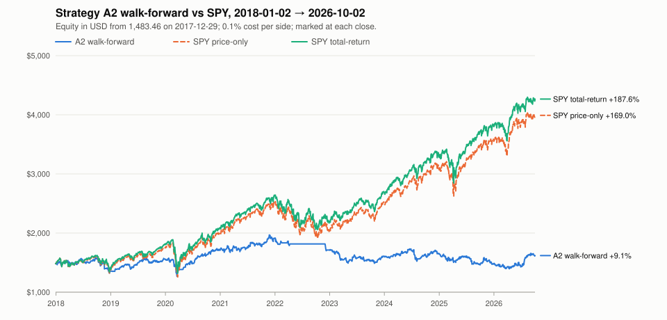
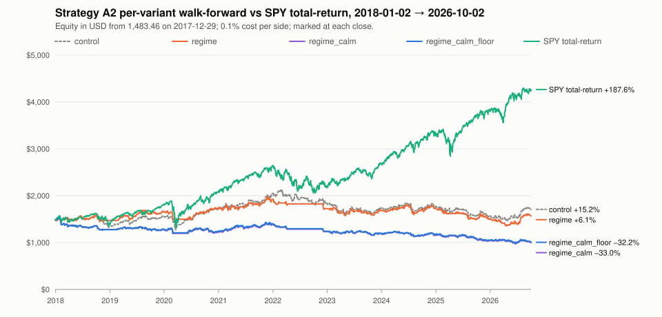

# Strategy A2 walk-forward (P3b), data through 2026-10-02

**P3b gate verdict:** Strategy A2 fails the P3b gate: walk-forward from 2018-01-02 to 2026-10-02 it returned +9.1% against +187.6% for total-return SPY, with profit factor 1.02 and max drawdown 29.1%, so it fails on beating total-return SPY, profit factor ≥ 1.3 and max drawdown ≤ 15%; Strategy A's one rework has failed, and P4 stays blocked.

## Data

- Data end (last bar loaded): 2026-10-02
- Bar rows loaded: 1,817,429
- Symbols with bars: 663
- Index members in the window with no bars at all: 115

| Window | Dates | Sessions | USD/IDR at start | Starting cash (USD) |
|:---|:---|---:|---:|---:|
| Tuning data (anchored, longest window) | 2015-10-19 → 2025-12-31 | 2,566 | — | — |
| Walk-forward (traded) | 2018-01-02 → 2026-10-02 | 2,200 | 13,482.0000 | 1,483.46 |
| Seen before (a slice of the walk-forward) | 2022-01-03 → 2026-10-02 | 1,192 | — | — |

## Method

- **Strategy A2** is Strategy A (design §4) with one variant rule on top. The base rules do not change: a setup needs close > SMA(200), Wilder RSI(2) < `rsi_max` and 20-session mean close × volume > `min_dollar_volume` (design: RSI < 10, $20000000). Limit = close − `limit_atr` × ATR(14), TP = limit + `tp_atr` × ATR(14), SL = limit − `sl_atr` × ATR(14), each to 4 dp.
- **Everything tried.** These four variants were fixed before any result was seen, and none was added after:
  - `control` (V0): Strategy A v1 exactly. Candidates are ranked by RSI(2) ascending, with the symbol breaking ties.
  - `regime` (V1): V0, plus no new picks on a data date where SPY's close ≤ SPY's SMA(200). The regime is on only when the close is strictly above it. Too little SPY history also means no new picks. SPY itself is never a pick.
  - `regime_calm` (V2): V1, but candidates are ranked by ATR(14) / close ascending, then RSI(2), then the symbol.
  - `regime_calm_floor` (V3): V2, plus a candidate's close must be ≥ $10.00. The floor is fixed, not tuned.
  - Each variant runs on the P3 grid: RSI {5, 10, 15} × limit {0.25, 0.5, 0.75} × TP {0.75, 1.0, 1.5} × SL {1.0, 1.5, 2.0} ATR (81 sets). Every fold searched the same 324 combinations, ordered by variant and then by grid order. Every run is in [`2026-10-02-strategy-a2-walkforward-grid.csv`](2026-10-02-strategy-a2-walkforward-grid.csv).
- **Anchored yearly walk-forward.** For each trade year Y, the fold tunes on 2015-10-19 → the last session of Y − 1, then trades from the first session of Y to the last session of Y (or the data end). Folds: 2018, 2019, 2020, 2021, 2022, 2023, 2024, 2025, 2026. The traded years form one continuous portfolio from 2018-01-02. Parameters switch at each year boundary, and an order already placed keeps the bracket it was placed with.
- **Selection, per fold.** The fold takes the highest tuning-window total return among combinations with max drawdown ≤ 15% and profit factor ≥ 1.3. Ties go to the lower max drawdown, then to combination order. If none qualifies, the fold trades `control` with the design values. Nothing is ever selected on traded data. The selection reasons below say "in-sample" and mean the fold's tuning window.
- **Per-variant curves.** Each variant also gets its own walk-forward, with the variant fixed and the grid tuned per fold. A fold where none of its runs qualifies trades that variant with the design values. These curves show how fragile the result is. They are not the gate, and picking the best of them now would be selecting on traded data.
- **Tuning runs.** Each combination runs once over the longest tuning window, and each fold reads its metrics at its own tuning end. The simulator never looks ahead, so this equals a fresh run on each fold's window.
- **No look-ahead.** Picks for session S use bars through the previous session only, SPY's included. The universe is S&P 500 ∪ Nasdaq-100 members on that data date (point in time).
- **One simulator.** Every size, fill, exit and cost (0.1% per side, whole shares, 4 slots) comes from `seer_engine.sim`, unchanged. The walk-forward is one fresh portfolio of 20,000,000 IDR, converted at the USD/IDR rate of its first session. A held symbol whose bars end for good is closed at its last close (a forced `time` exit).
- **SPY benchmarks.** They start with the same cash on the session before the first traded session. They buy whole shares at the first session's open after the 0.1% cost, hold, and mark at each close. Price-only ignores dividends. Total-return reinvests each dividend at the ex-date close (whole shares, with cost). At the end, open positions and the SPY holding are both marked at the last close and never sold.
- **Metrics** follow `web/lib/metrics.ts`:
  - Total return = last / first equity − 1. Every curve starts at the starting cash on the session before its window.
  - A win is P/L > 0 and a loss is P/L ≤ 0. Profit factor = gross win / gross loss (∞ with no loss).
  - Max drawdown is measured on per-session equity. Months = calendar days / 30.44.
  - CAGR = (last / first)^(1 / years) − 1, with years = calendar days between the first and last snapshot / 365.25 (Actual/365.25).
  - Avg days held is the mean of the simulator's `days_held` over closed trades.
- **Diagnostics** explain the result and never feed any selection. They are P/L by exit reason and by exit year (net of costs), the trades with fewer than 3 shares, and cost drag = Σ costs ÷ Σ gross P/L (both 0.1% sides).
- **Gate (P3b).** A2 passes only if the walk-forward curve beats total-return SPY over the same span, with profit factor ≥ 1.3 and max drawdown ≤ 15%. Nothing else decides it.
- **Seen before.** P3 already judged Strategy A v1 on the window from 2022-01-03 on, so that window is not out-of-sample any more. It is shown below only as a slice of the continuous curves, for information.
- **One round only.** This rework runs once. If A2 fails the gate, Strategy A is not reworked again on this data.

## Folds

Each fold tunes on everything from the anchored start to the end of the year before, then trades one year with the combination it selected. The selection reads the tuning window and nothing else.

| Year | Tuning window | Traded | Qualifying | Variant | RSI(2) < | Limit ×ATR | TP ×ATR | SL ×ATR | Selection |
|:---|:---|:---|---:|:---|---:|---:|---:|---:|:---|
| 2018 | 2015-10-19 → 2017-12-29 | 2018-01-02 → 2018-12-31 | 0 of 324 | `control` | 10 | 0.5 | 1 | 1.5 | fallback |
| 2019 | 2015-10-19 → 2018-12-31 | 2019-01-02 → 2019-12-31 | 0 of 324 | `control` | 10 | 0.5 | 1 | 1.5 | fallback |
| 2020 | 2015-10-19 → 2019-12-31 | 2020-01-02 → 2020-12-31 | 0 of 324 | `control` | 10 | 0.5 | 1 | 1.5 | fallback |
| 2021 | 2015-10-19 → 2020-12-31 | 2021-01-04 → 2021-12-31 | 1 of 324 | `regime` | 15 | 0.5 | 0.75 | 2 | qualified |
| 2022 | 2015-10-19 → 2021-12-31 | 2022-01-03 → 2022-12-30 | 2 of 324 | `regime` | 15 | 0.5 | 0.75 | 2 | qualified |
| 2023 | 2015-10-19 → 2022-12-30 | 2023-01-03 → 2023-12-29 | 0 of 324 | `control` | 10 | 0.5 | 1 | 1.5 | fallback |
| 2024 | 2015-10-19 → 2023-12-29 | 2024-01-02 → 2024-12-31 | 0 of 324 | `control` | 10 | 0.5 | 1 | 1.5 | fallback |
| 2025 | 2015-10-19 → 2024-12-31 | 2025-01-02 → 2025-12-31 | 0 of 324 | `control` | 10 | 0.5 | 1 | 1.5 | fallback |
| 2026 | 2015-10-19 → 2025-12-31 | 2026-01-02 → 2026-10-02 | 0 of 324 | `control` | 10 | 0.5 | 1 | 1.5 | fallback |

### 2018

- Tuning window: 2015-10-19 → 2017-12-29 (555 sessions)
- Traded: 2018-01-02 → 2018-12-31 (251 sessions)
- Selected: `control`, RSI(2) < 10, limit 0.5 × ATR, TP 1 × ATR, SL 1.5 × ATR, 20-session dollar volume > $20000000 (fallback)

No in-sample grid run had max drawdown ≤ 15% and profit factor ≥ 1.3 (0 of 324), so the design values are kept.

Top 10 of 324 combinations. Qualifying runs come first, by tuning-window total return, then the lower max drawdown, then combination order. The rest follow in the same order. "#" is the combination's position in the grid CSV.

| Rank | # | Variant | RSI(2) < | Limit ×ATR | TP ×ATR | SL ×ATR | Total return | CAGR | Win rate | Profit factor | Max drawdown | Trades | Qualifies | Selected |
|---:|---:|:---|---:|---:|---:|---:|---:|---:|---:|---:|---:|---:|:---|:---|
| 1 | 33 | `control` | 10 | 0.25 | 1 | 2 | +20.8% | +8.9% | 60.1% | 1.18 | 10.6% | 434 | no |  |
| 2 | 6 | `control` | 5 | 0.25 | 1 | 2 | +18.0% | +7.8% | 59.5% | 1.19 | 9.1% | 388 | no |  |
| 3 | 69 | `control` | 15 | 0.5 | 1 | 2 | +17.3% | +7.5% | 60.1% | 1.18 | 9.5% | 386 | no |  |
| 4 | 81 | `control` | 15 | 0.75 | 1.5 | 2 | +14.7% | +6.4% | 53.9% | 1.20 | 8.9% | 269 | no |  |
| 5 | 60 | `control` | 15 | 0.25 | 1 | 2 | +14.5% | +6.3% | 60.2% | 1.13 | 10.3% | 452 | no |  |
| 6 | 42 | `control` | 10 | 0.5 | 1 | 2 | +14.1% | +6.2% | 59.5% | 1.16 | 9.5% | 365 | no |  |
| 7 | 131 | `regime` | 10 | 0.75 | 1 | 1.5 | +14.1% | +6.2% | 59.3% | 1.26 | 7.3% | 263 | no |  |
| 8 | 66 | `control` | 15 | 0.5 | 0.75 | 2 | +14.0% | +6.1% | 64.8% | 1.15 | 8.5% | 412 | no |  |
| 9 | 30 | `control` | 10 | 0.25 | 0.75 | 2 | +13.7% | +6.0% | 64.3% | 1.13 | 10.0% | 473 | no |  |
| 10 | 58 | `control` | 15 | 0.25 | 1 | 1 | +13.6% | +5.9% | 52.9% | 1.10 | 14.3% | 531 | no |  |

The selected combination (#41) is outside the top 10. Its row is in [`2026-10-02-strategy-a2-walkforward-grid.csv`](2026-10-02-strategy-a2-walkforward-grid.csv).

### 2019

- Tuning window: 2015-10-19 → 2018-12-31 (806 sessions)
- Traded: 2019-01-02 → 2019-12-31 (252 sessions)
- Selected: `control`, RSI(2) < 10, limit 0.5 × ATR, TP 1 × ATR, SL 1.5 × ATR, 20-session dollar volume > $20000000 (fallback)

No in-sample grid run had max drawdown ≤ 15% and profit factor ≥ 1.3 (0 of 324), so the design values are kept.

Top 10 of 324 combinations. Qualifying runs come first, by tuning-window total return, then the lower max drawdown, then combination order. The rest follow in the same order. "#" is the combination's position in the grid CSV.

| Rank | # | Variant | RSI(2) < | Limit ×ATR | TP ×ATR | SL ×ATR | Total return | CAGR | Win rate | Profit factor | Max drawdown | Trades | Qualifies | Selected |
|---:|---:|:---|---:|---:|---:|---:|---:|---:|---:|---:|---:|---:|:---|:---|
| 1 | 33 | `control` | 10 | 0.25 | 1 | 2 | +17.7% | +5.2% | 59.7% | 1.09 | 14.2% | 642 | no |  |
| 2 | 131 | `regime` | 10 | 0.75 | 1 | 1.5 | +17.0% | +5.0% | 58.2% | 1.19 | 7.3% | 376 | no |  |
| 3 | 128 | `regime` | 10 | 0.75 | 0.75 | 1.5 | +15.8% | +4.7% | 63.8% | 1.19 | 5.9% | 395 | no |  |
| 4 | 81 | `control` | 15 | 0.75 | 1.5 | 2 | +15.5% | +4.6% | 54.4% | 1.13 | 8.9% | 397 | no |  |
| 5 | 130 | `regime` | 10 | 0.75 | 1 | 1 | +13.7% | +4.1% | 54.2% | 1.15 | 6.3% | 393 | no |  |
| 6 | 158 | `regime` | 15 | 0.75 | 1 | 1.5 | +13.1% | +3.9% | 57.8% | 1.14 | 7.7% | 389 | no |  |
| 7 | 150 | `regime` | 15 | 0.5 | 1 | 2 | +12.8% | +3.8% | 59.6% | 1.11 | 10.2% | 483 | no |  |
| 8 | 132 | `regime` | 10 | 0.75 | 1 | 2 | +12.7% | +3.8% | 59.3% | 1.15 | 7.3% | 351 | no |  |
| 9 | 146 | `regime` | 15 | 0.5 | 0.75 | 1.5 | +12.7% | +3.8% | 63.1% | 1.10 | 9.9% | 555 | no |  |
| 10 | 119 | `regime` | 10 | 0.5 | 0.75 | 1.5 | +12.6% | +3.8% | 63.5% | 1.11 | 10.2% | 534 | no |  |

The selected combination (#41) is outside the top 10. Its row is in [`2026-10-02-strategy-a2-walkforward-grid.csv`](2026-10-02-strategy-a2-walkforward-grid.csv).

### 2020

- Tuning window: 2015-10-19 → 2019-12-31 (1,058 sessions)
- Traded: 2020-01-02 → 2020-12-31 (253 sessions)
- Selected: `control`, RSI(2) < 10, limit 0.5 × ATR, TP 1 × ATR, SL 1.5 × ATR, 20-session dollar volume > $20000000 (fallback)

No in-sample grid run had max drawdown ≤ 15% and profit factor ≥ 1.3 (0 of 324), so the design values are kept.

Top 10 of 324 combinations. Qualifying runs come first, by tuning-window total return, then the lower max drawdown, then combination order. The rest follow in the same order. "#" is the combination's position in the grid CSV.

| Rank | # | Variant | RSI(2) < | Limit ×ATR | TP ×ATR | SL ×ATR | Total return | CAGR | Win rate | Profit factor | Max drawdown | Trades | Qualifies | Selected |
|---:|---:|:---|---:|---:|---:|---:|---:|---:|---:|---:|---:|---:|:---|:---|
| 1 | 131 | `regime` | 10 | 0.75 | 1 | 1.5 | +34.6% | +7.3% | 60.9% | 1.29 | 7.3% | 501 | no |  |
| 2 | 150 | `regime` | 15 | 0.5 | 1 | 2 | +32.5% | +6.9% | 61.7% | 1.21 | 10.2% | 632 | no |  |
| 3 | 132 | `regime` | 10 | 0.75 | 1 | 2 | +32.3% | +6.9% | 62.4% | 1.28 | 7.3% | 473 | no |  |
| 4 | 147 | `regime` | 15 | 0.5 | 0.75 | 2 | +32.1% | +6.8% | 66.7% | 1.21 | 9.1% | 682 | no |  |
| 5 | 123 | `regime` | 10 | 0.5 | 1 | 2 | +29.9% | +6.4% | 61.9% | 1.21 | 9.8% | 612 | no |  |
| 6 | 120 | `regime` | 10 | 0.5 | 0.75 | 2 | +28.6% | +6.2% | 67.3% | 1.20 | 10.5% | 663 | no |  |
| 7 | 158 | `regime` | 15 | 0.75 | 1 | 1.5 | +28.3% | +6.1% | 60.3% | 1.23 | 7.7% | 517 | no |  |
| 8 | 78 | `control` | 15 | 0.75 | 1 | 2 | +27.4% | +5.9% | 62.4% | 1.18 | 10.8% | 559 | no |  |
| 9 | 119 | `regime` | 10 | 0.5 | 0.75 | 1.5 | +27.3% | +5.9% | 65.4% | 1.18 | 10.2% | 702 | no |  |
| 10 | 159 | `regime` | 15 | 0.75 | 1 | 2 | +27.2% | +5.9% | 62.0% | 1.23 | 8.2% | 489 | no |  |

The selected combination (#41) is outside the top 10. Its row is in [`2026-10-02-strategy-a2-walkforward-grid.csv`](2026-10-02-strategy-a2-walkforward-grid.csv).

### 2021

- Tuning window: 2015-10-19 → 2020-12-31 (1,311 sessions)
- Traded: 2021-01-04 → 2021-12-31 (252 sessions)
- Selected: `regime`, RSI(2) < 15, limit 0.5 × ATR, TP 0.75 × ATR, SL 2 × ATR, 20-session dollar volume > $20000000 (qualified)

Grid run #147 has the highest in-sample total return (+61.7%, max drawdown 15.0%) among the 1 of 324 runs with max drawdown ≤ 15% and profit factor ≥ 1.3.

Top 10 of 324 combinations. Qualifying runs come first, by tuning-window total return, then the lower max drawdown, then combination order. The rest follow in the same order. "#" is the combination's position in the grid CSV.

| Rank | # | Variant | RSI(2) < | Limit ×ATR | TP ×ATR | SL ×ATR | Total return | CAGR | Win rate | Profit factor | Max drawdown | Trades | Qualifies | Selected |
|---:|---:|:---|---:|---:|---:|---:|---:|---:|---:|---:|---:|---:|:---|:---|
| 1 | 147 | `regime` | 15 | 0.5 | 0.75 | 2 | +61.7% | +9.7% | 67.6% | 1.33 | 15.0% | 837 | yes | selected |
| 2 | 150 | `regime` | 15 | 0.5 | 1 | 2 | +55.5% | +8.8% | 62.1% | 1.29 | 14.8% | 768 | no |  |
| 3 | 120 | `regime` | 10 | 0.5 | 0.75 | 2 | +47.6% | +7.8% | 68.1% | 1.27 | 13.6% | 805 | no |  |
| 4 | 146 | `regime` | 15 | 0.5 | 0.75 | 1.5 | +47.0% | +7.7% | 65.3% | 1.24 | 12.9% | 883 | no |  |
| 5 | 123 | `regime` | 10 | 0.5 | 1 | 2 | +46.7% | +7.6% | 62.5% | 1.26 | 13.0% | 738 | no |  |
| 6 | 71 | `control` | 15 | 0.5 | 1.5 | 1.5 | +46.2% | +7.6% | 52.6% | 1.18 | 23.5% | 834 | no |  |
| 7 | 69 | `control` | 15 | 0.5 | 1 | 2 | +45.8% | +7.5% | 61.8% | 1.19 | 22.6% | 876 | no |  |
| 8 | 66 | `control` | 15 | 0.5 | 0.75 | 2 | +44.6% | +7.3% | 66.9% | 1.19 | 22.8% | 947 | no |  |
| 9 | 131 | `regime` | 10 | 0.75 | 1 | 1.5 | +42.5% | +7.0% | 61.4% | 1.28 | 11.0% | 594 | no |  |
| 10 | 72 | `control` | 15 | 0.5 | 1.5 | 2 | +42.4% | +7.0% | 54.9% | 1.17 | 21.1% | 793 | no |  |

### 2022

- Tuning window: 2015-10-19 → 2021-12-31 (1,563 sessions)
- Traded: 2022-01-03 → 2022-12-30 (251 sessions)
- Selected: `regime`, RSI(2) < 15, limit 0.5 × ATR, TP 0.75 × ATR, SL 2 × ATR, 20-session dollar volume > $20000000 (qualified)

Grid run #147 has the highest in-sample total return (+80.6%, max drawdown 15.0%) among the 2 of 324 runs with max drawdown ≤ 15% and profit factor ≥ 1.3.

Top 10 of 324 combinations. Qualifying runs come first, by tuning-window total return, then the lower max drawdown, then combination order. The rest follow in the same order. "#" is the combination's position in the grid CSV.

| Rank | # | Variant | RSI(2) < | Limit ×ATR | TP ×ATR | SL ×ATR | Total return | CAGR | Win rate | Profit factor | Max drawdown | Trades | Qualifies | Selected |
|---:|---:|:---|---:|---:|---:|---:|---:|---:|---:|---:|---:|---:|:---|:---|
| 1 | 147 | `regime` | 15 | 0.5 | 0.75 | 2 | +80.6% | +10.0% | 67.3% | 1.30 | 15.0% | 1016 | yes | selected |
| 2 | 120 | `regime` | 10 | 0.5 | 0.75 | 2 | +73.4% | +9.3% | 68.1% | 1.30 | 13.6% | 980 | yes |  |
| 3 | 71 | `control` | 15 | 0.5 | 1.5 | 1.5 | +75.0% | +9.4% | 53.6% | 1.23 | 23.5% | 988 | no |  |
| 4 | 119 | `regime` | 10 | 0.5 | 0.75 | 1.5 | +71.8% | +9.1% | 66.1% | 1.28 | 11.7% | 1033 | no |  |
| 5 | 72 | `control` | 15 | 0.5 | 1.5 | 2 | +70.8% | +9.0% | 55.6% | 1.23 | 21.1% | 939 | no |  |
| 6 | 146 | `regime` | 15 | 0.5 | 0.75 | 1.5 | +70.5% | +9.0% | 65.5% | 1.25 | 12.9% | 1075 | no |  |
| 7 | 6 | `control` | 5 | 0.25 | 1 | 2 | +67.1% | +8.6% | 61.4% | 1.22 | 22.9% | 1057 | no |  |
| 8 | 123 | `regime` | 10 | 0.5 | 1 | 2 | +67.1% | +8.6% | 62.4% | 1.27 | 13.0% | 902 | no |  |
| 9 | 150 | `regime` | 15 | 0.5 | 1 | 2 | +66.5% | +8.6% | 61.8% | 1.24 | 14.8% | 936 | no |  |
| 10 | 153 | `regime` | 15 | 0.5 | 1.5 | 2 | +64.6% | +8.4% | 55.4% | 1.26 | 14.9% | 837 | no |  |

### 2023

- Tuning window: 2015-10-19 → 2022-12-30 (1,814 sessions)
- Traded: 2023-01-03 → 2023-12-29 (250 sessions)
- Selected: `control`, RSI(2) < 10, limit 0.5 × ATR, TP 1 × ATR, SL 1.5 × ATR, 20-session dollar volume > $20000000 (fallback)

No in-sample grid run had max drawdown ≤ 15% and profit factor ≥ 1.3 (0 of 324), so the design values are kept.

Top 10 of 324 combinations. Qualifying runs come first, by tuning-window total return, then the lower max drawdown, then combination order. The rest follow in the same order. "#" is the combination's position in the grid CSV.

| Rank | # | Variant | RSI(2) < | Limit ×ATR | TP ×ATR | SL ×ATR | Total return | CAGR | Win rate | Profit factor | Max drawdown | Trades | Qualifies | Selected |
|---:|---:|:---|---:|---:|---:|---:|---:|---:|---:|---:|---:|---:|:---|:---|
| 1 | 147 | `regime` | 15 | 0.5 | 0.75 | 2 | +55.5% | +6.3% | 66.6% | 1.18 | 18.3% | 1050 | no |  |
| 2 | 6 | `control` | 5 | 0.25 | 1 | 2 | +55.2% | +6.3% | 60.1% | 1.13 | 22.9% | 1202 | no |  |
| 3 | 146 | `regime` | 15 | 0.5 | 0.75 | 1.5 | +54.9% | +6.3% | 64.8% | 1.18 | 12.9% | 1112 | no |  |
| 4 | 119 | `regime` | 10 | 0.5 | 0.75 | 1.5 | +54.8% | +6.3% | 65.4% | 1.19 | 11.7% | 1068 | no |  |
| 5 | 153 | `regime` | 15 | 0.5 | 1.5 | 2 | +52.1% | +6.0% | 54.9% | 1.19 | 14.9% | 867 | no |  |
| 6 | 120 | `regime` | 10 | 0.5 | 0.75 | 2 | +50.9% | +5.9% | 67.2% | 1.18 | 14.0% | 1012 | no |  |
| 7 | 14 | `control` | 5 | 0.5 | 1 | 1.5 | +48.7% | +5.7% | 58.4% | 1.16 | 17.0% | 1028 | no |  |
| 8 | 150 | `regime` | 15 | 0.5 | 1 | 2 | +48.7% | +5.7% | 61.1% | 1.16 | 14.8% | 970 | no |  |
| 9 | 38 | `control` | 10 | 0.5 | 0.75 | 1.5 | +47.9% | +5.6% | 64.6% | 1.12 | 20.1% | 1296 | no |  |
| 10 | 123 | `regime` | 10 | 0.5 | 1 | 2 | +45.5% | +5.3% | 61.6% | 1.16 | 13.9% | 934 | no |  |

The selected combination (#41) is outside the top 10. Its row is in [`2026-10-02-strategy-a2-walkforward-grid.csv`](2026-10-02-strategy-a2-walkforward-grid.csv).

### 2024

- Tuning window: 2015-10-19 → 2023-12-29 (2,064 sessions)
- Traded: 2024-01-02 → 2024-12-31 (252 sessions)
- Selected: `control`, RSI(2) < 10, limit 0.5 × ATR, TP 1 × ATR, SL 1.5 × ATR, 20-session dollar volume > $20000000 (fallback)

No in-sample grid run had max drawdown ≤ 15% and profit factor ≥ 1.3 (0 of 324), so the design values are kept.

Top 10 of 324 combinations. Qualifying runs come first, by tuning-window total return, then the lower max drawdown, then combination order. The rest follow in the same order. "#" is the combination's position in the grid CSV.

| Rank | # | Variant | RSI(2) < | Limit ×ATR | TP ×ATR | SL ×ATR | Total return | CAGR | Win rate | Profit factor | Max drawdown | Trades | Qualifies | Selected |
|---:|---:|:---|---:|---:|---:|---:|---:|---:|---:|---:|---:|---:|:---|:---|
| 1 | 147 | `regime` | 15 | 0.5 | 0.75 | 2 | +48.7% | +5.0% | 65.7% | 1.13 | 26.7% | 1202 | no |  |
| 2 | 146 | `regime` | 15 | 0.5 | 0.75 | 1.5 | +43.8% | +4.5% | 64.1% | 1.12 | 22.6% | 1275 | no |  |
| 3 | 6 | `control` | 5 | 0.25 | 1 | 2 | +43.0% | +4.5% | 59.5% | 1.09 | 23.2% | 1362 | no |  |
| 4 | 153 | `regime` | 15 | 0.5 | 1.5 | 2 | +43.0% | +4.5% | 54.8% | 1.13 | 21.2% | 997 | no |  |
| 5 | 119 | `regime` | 10 | 0.5 | 0.75 | 1.5 | +40.5% | +4.2% | 64.4% | 1.12 | 23.3% | 1221 | no |  |
| 6 | 120 | `regime` | 10 | 0.5 | 0.75 | 2 | +40.2% | +4.2% | 66.2% | 1.12 | 25.3% | 1154 | no |  |
| 7 | 150 | `regime` | 15 | 0.5 | 1 | 2 | +38.4% | +4.0% | 60.7% | 1.10 | 26.1% | 1117 | no |  |
| 8 | 123 | `regime` | 10 | 0.5 | 1 | 2 | +36.2% | +3.8% | 60.9% | 1.11 | 25.3% | 1071 | no |  |
| 9 | 131 | `regime` | 10 | 0.75 | 1 | 1.5 | +33.4% | +3.6% | 60.1% | 1.13 | 16.8% | 858 | no |  |
| 10 | 158 | `regime` | 15 | 0.75 | 1 | 1.5 | +32.8% | +3.5% | 59.8% | 1.12 | 13.4% | 890 | no |  |

The selected combination (#41) is outside the top 10. Its row is in [`2026-10-02-strategy-a2-walkforward-grid.csv`](2026-10-02-strategy-a2-walkforward-grid.csv).

### 2025

- Tuning window: 2015-10-19 → 2024-12-31 (2,316 sessions)
- Traded: 2025-01-02 → 2025-12-31 (250 sessions)
- Selected: `control`, RSI(2) < 10, limit 0.5 × ATR, TP 1 × ATR, SL 1.5 × ATR, 20-session dollar volume > $20000000 (fallback)

No in-sample grid run had max drawdown ≤ 15% and profit factor ≥ 1.3 (0 of 324), so the design values are kept.

Top 10 of 324 combinations. Qualifying runs come first, by tuning-window total return, then the lower max drawdown, then combination order. The rest follow in the same order. "#" is the combination's position in the grid CSV.

| Rank | # | Variant | RSI(2) < | Limit ×ATR | TP ×ATR | SL ×ATR | Total return | CAGR | Win rate | Profit factor | Max drawdown | Trades | Qualifies | Selected |
|---:|---:|:---|---:|---:|---:|---:|---:|---:|---:|---:|---:|---:|:---|:---|
| 1 | 147 | `regime` | 15 | 0.5 | 0.75 | 2 | +45.6% | +4.2% | 65.4% | 1.11 | 26.7% | 1386 | no |  |
| 2 | 146 | `regime` | 15 | 0.5 | 0.75 | 1.5 | +42.3% | +3.9% | 63.6% | 1.09 | 22.6% | 1466 | no |  |
| 3 | 153 | `regime` | 15 | 0.5 | 1.5 | 2 | +41.9% | +3.9% | 54.2% | 1.10 | 21.2% | 1154 | no |  |
| 4 | 119 | `regime` | 10 | 0.5 | 0.75 | 1.5 | +41.5% | +3.8% | 64.0% | 1.10 | 23.3% | 1409 | no |  |
| 5 | 150 | `regime` | 15 | 0.5 | 1 | 2 | +41.0% | +3.8% | 60.2% | 1.10 | 26.1% | 1288 | no |  |
| 6 | 120 | `regime` | 10 | 0.5 | 0.75 | 2 | +37.2% | +3.5% | 65.8% | 1.09 | 25.3% | 1335 | no |  |
| 7 | 149 | `regime` | 15 | 0.5 | 1 | 1.5 | +37.1% | +3.5% | 58.1% | 1.09 | 18.4% | 1349 | no |  |
| 8 | 6 | `control` | 5 | 0.25 | 1 | 2 | +36.9% | +3.5% | 59.1% | 1.07 | 23.2% | 1556 | no |  |
| 9 | 123 | `regime` | 10 | 0.5 | 1 | 2 | +35.4% | +3.3% | 60.3% | 1.09 | 25.3% | 1239 | no |  |
| 10 | 122 | `regime` | 10 | 0.5 | 1 | 1.5 | +33.4% | +3.2% | 58.4% | 1.09 | 18.4% | 1297 | no |  |

The selected combination (#41) is outside the top 10. Its row is in [`2026-10-02-strategy-a2-walkforward-grid.csv`](2026-10-02-strategy-a2-walkforward-grid.csv).

### 2026

- Tuning window: 2015-10-19 → 2025-12-31 (2,566 sessions)
- Traded: 2026-01-02 → 2026-10-02 (189 sessions)
- Selected: `control`, RSI(2) < 10, limit 0.5 × ATR, TP 1 × ATR, SL 1.5 × ATR, 20-session dollar volume > $20000000 (fallback)

No in-sample grid run had max drawdown ≤ 15% and profit factor ≥ 1.3 (0 of 324), so the design values are kept.

Top 10 of 324 combinations. Qualifying runs come first, by tuning-window total return, then the lower max drawdown, then combination order. The rest follow in the same order. "#" is the combination's position in the grid CSV.

| Rank | # | Variant | RSI(2) < | Limit ×ATR | TP ×ATR | SL ×ATR | Total return | CAGR | Win rate | Profit factor | Max drawdown | Trades | Qualifies | Selected |
|---:|---:|:---|---:|---:|---:|---:|---:|---:|---:|---:|---:|---:|:---|:---|
| 1 | 153 | `regime` | 15 | 0.5 | 1.5 | 2 | +51.4% | +4.1% | 54.2% | 1.11 | 21.2% | 1282 | no |  |
| 2 | 261 | `regime_calm_floor` | 5 | 0.5 | 1.5 | 2 | +30.8% | +2.7% | 53.4% | 1.10 | 15.4% | 1149 | no |  |
| 3 | 180 | `regime_calm` | 5 | 0.5 | 1.5 | 2 | +30.7% | +2.7% | 53.3% | 1.10 | 15.0% | 1148 | no |  |
| 4 | 147 | `regime` | 15 | 0.5 | 0.75 | 2 | +28.8% | +2.5% | 64.6% | 1.06 | 32.0% | 1529 | no |  |
| 5 | 126 | `regime` | 10 | 0.5 | 1.5 | 2 | +27.0% | +2.4% | 54.3% | 1.06 | 22.7% | 1234 | no |  |
| 6 | 215 | `regime_calm` | 10 | 0.75 | 1.5 | 1.5 | +26.2% | +2.3% | 53.5% | 1.10 | 11.4% | 1082 | no |  |
| 7 | 296 | `regime_calm_floor` | 10 | 0.75 | 1.5 | 1.5 | +25.4% | +2.2% | 53.3% | 1.10 | 11.4% | 1082 | no |  |
| 8 | 123 | `regime` | 10 | 0.5 | 1 | 2 | +24.5% | +2.2% | 59.5% | 1.05 | 26.9% | 1374 | no |  |
| 9 | 323 | `regime_calm_floor` | 15 | 0.75 | 1.5 | 1.5 | +23.0% | +2.0% | 55.1% | 1.09 | 12.2% | 1127 | no |  |
| 10 | 146 | `regime` | 15 | 0.5 | 0.75 | 1.5 | +23.0% | +2.0% | 62.9% | 1.04 | 30.1% | 1617 | no |  |

The selected combination (#41) is outside the top 10. Its row is in [`2026-10-02-strategy-a2-walkforward-grid.csv`](2026-10-02-strategy-a2-walkforward-grid.csv).

## Walk-forward results

One continuous portfolio over every traded year. Each year traded the combination its fold selected, and no year's numbers fed any selection. This is the evidence the gate reads.

### Walk-forward vs SPY (2018-01-02 → 2026-10-02, 2,200 sessions)

| Metric | Strategy A2 walk-forward | SPY price-only | SPY total-return |
|:---|---:|---:|---:|
| Ending equity (USD) | 1,618.60 | 3,991.12 | 4,266.20 |
| Total return | +9.1% | +169.0% | +187.6% |
| CAGR | +1.0% | +12.0% | +12.8% |
| Win rate | 58.3% | — | — |
| Profit factor | 1.02 | — | — |
| Max drawdown | 29.1% | 31.4% | 30.2% |
| Trades (closed) | 1329 | — | — |
| Avg days held | 3.39 | — | — |
| Exits: take profit | 634 | — | — |
| Exits: stop loss | 244 | — | — |
| Exits: time stop | 376 | — | — |
| Exits: gap at the open | 75 | — | — |
| Forced closes (bars ended; inside time stop) | 0 | — | — |
| Open at end | 3 | — | — |
| Months | 105.1 | 105.1 | 105.1 |
| SPY shares at end | — | 5 | 5 |
| SPY dividends credited (USD) | — | — | 275.08 |

Picks the simulator rejected: held 1,567, lt_one_share 380, no_slot 50,682.

### Year by year

Each traded year's return, from the close before its first session to its last close.

| Year | Traded | Parameters | Walk-forward | SPY price-only | SPY total-return |
|:---|:---|:---|---:|---:|---:|
| 2018 | 2018-01-02 → 2018-12-31 | `control`, RSI 10, limit 0.5, TP 1, SL 1.5 (fallback) | −8.7% | −6.1% | −4.4% |
| 2019 | 2019-01-02 → 2019-12-31 | `control`, RSI 10, limit 0.5, TP 1, SL 1.5 (fallback) | +14.9% | +25.8% | +27.3% |
| 2020 | 2020-01-02 → 2020-12-31 | `control`, RSI 10, limit 0.5, TP 1, SL 1.5 (fallback) | +9.8% | +14.8% | +16.0% |
| 2021 | 2021-01-04 → 2021-12-31 | `regime`, RSI 15, limit 0.5, TP 0.75, SL 2 | +11.8% | +25.1% | +25.5% |
| 2022 | 2022-01-03 → 2022-12-30 | `regime`, RSI 15, limit 0.5, TP 0.75, SL 2 | −10.3% | −18.4% | −16.4% |
| 2023 | 2023-01-03 → 2023-12-29 | `control`, RSI 10, limit 0.5, TP 1, SL 1.5 (fallback) | −6.1% | +22.6% | +22.6% |
| 2024 | 2024-01-02 → 2024-12-31 | `control`, RSI 10, limit 0.5, TP 1, SL 1.5 (fallback) | +2.8% | +22.0% | +21.9% |
| 2025 | 2025-01-02 → 2025-12-31 | `control`, RSI 10, limit 0.5, TP 1, SL 1.5 (fallback) | −10.8% | +15.6% | +15.7% |
| 2026 | 2026-01-02 → 2026-10-02 | `control`, RSI 10, limit 0.5, TP 1, SL 1.5 (fallback) | +9.8% | +12.3% | +12.3% |

## Per-variant walk-forward

Each variant's own walk-forward, with the variant fixed and its grid tuned per fold, next to the walk-forward that chose the variant per fold. These show how fragile the result is. Only the walk-forward row is gated, and choosing the best row here would be selecting on traded data.

| Curve | Ending equity (USD) | Total return | CAGR | Win rate | Profit factor | Max drawdown | Trades | Meets the gate's rules |
|:---|---:|---:|---:|---:|---:|---:|---:|:---|
| Walk-forward | 1,618.60 | +9.1% | +1.0% | 58.3% | 1.02 | 29.1% | 1329 | no: Beats SPY, Profit factor ≥ 1.3, Max drawdown ≤ 15% |
| `control` | 1,709.01 | +15.2% | +1.6% | 57.3% | 1.03 | 30.7% | 1448 | no: Beats SPY, Profit factor ≥ 1.3, Max drawdown ≤ 15% |
| `regime` | 1,574.12 | +6.1% | +0.7% | 58.3% | 1.02 | 31.3% | 1222 | no: Beats SPY, Profit factor ≥ 1.3, Max drawdown ≤ 15% |
| `regime_calm` | 994.47 | −33.0% | −4.5% | 55.8% | 0.86 | 36.4% | 1271 | no: Beats SPY, Profit factor ≥ 1.3, Max drawdown ≤ 15% |
| `regime_calm_floor` | 1,005.87 | −32.2% | −4.3% | 55.9% | 0.86 | 35.6% | 1270 | no: Beats SPY, Profit factor ≥ 1.3, Max drawdown ≤ 15% |
| SPY price-only | 3,991.12 | +169.0% | +12.0% | — | — | 31.4% | — | — |
| SPY total-return | 4,266.20 | +187.6% | +12.8% | — | — | 30.2% | — | — |

### Fold selections per curve

"(fallback)" marks a fold where no run qualified, so the design values were traded.

| Year | Walk-forward | `control` | `regime` | `regime_calm` | `regime_calm_floor` |
|:---|:---|:---|:---|:---|:---|
| 2018 | `control`, RSI 10, limit 0.5, TP 1, SL 1.5 (fallback) | RSI 10, limit 0.5, TP 1, SL 1.5 (fallback) | RSI 10, limit 0.5, TP 1, SL 1.5 (fallback) | RSI 10, limit 0.5, TP 1, SL 1.5 (fallback) | RSI 10, limit 0.5, TP 1, SL 1.5 (fallback) |
| 2019 | `control`, RSI 10, limit 0.5, TP 1, SL 1.5 (fallback) | RSI 10, limit 0.5, TP 1, SL 1.5 (fallback) | RSI 10, limit 0.5, TP 1, SL 1.5 (fallback) | RSI 10, limit 0.5, TP 1, SL 1.5 (fallback) | RSI 10, limit 0.5, TP 1, SL 1.5 (fallback) |
| 2020 | `control`, RSI 10, limit 0.5, TP 1, SL 1.5 (fallback) | RSI 10, limit 0.5, TP 1, SL 1.5 (fallback) | RSI 10, limit 0.5, TP 1, SL 1.5 (fallback) | RSI 10, limit 0.5, TP 1, SL 1.5 (fallback) | RSI 10, limit 0.5, TP 1, SL 1.5 (fallback) |
| 2021 | `regime`, RSI 15, limit 0.5, TP 0.75, SL 2 | RSI 10, limit 0.5, TP 1, SL 1.5 (fallback) | RSI 15, limit 0.5, TP 0.75, SL 2 | RSI 10, limit 0.5, TP 1, SL 1.5 (fallback) | RSI 10, limit 0.5, TP 1, SL 1.5 (fallback) |
| 2022 | `regime`, RSI 15, limit 0.5, TP 0.75, SL 2 | RSI 10, limit 0.5, TP 1, SL 1.5 (fallback) | RSI 15, limit 0.5, TP 0.75, SL 2 | RSI 10, limit 0.5, TP 1, SL 1.5 (fallback) | RSI 10, limit 0.5, TP 1, SL 1.5 (fallback) |
| 2023 | `control`, RSI 10, limit 0.5, TP 1, SL 1.5 (fallback) | RSI 10, limit 0.5, TP 1, SL 1.5 (fallback) | RSI 10, limit 0.5, TP 1, SL 1.5 (fallback) | RSI 10, limit 0.5, TP 1, SL 1.5 (fallback) | RSI 10, limit 0.5, TP 1, SL 1.5 (fallback) |
| 2024 | `control`, RSI 10, limit 0.5, TP 1, SL 1.5 (fallback) | RSI 10, limit 0.5, TP 1, SL 1.5 (fallback) | RSI 10, limit 0.5, TP 1, SL 1.5 (fallback) | RSI 10, limit 0.5, TP 1, SL 1.5 (fallback) | RSI 10, limit 0.5, TP 1, SL 1.5 (fallback) |
| 2025 | `control`, RSI 10, limit 0.5, TP 1, SL 1.5 (fallback) | RSI 10, limit 0.5, TP 1, SL 1.5 (fallback) | RSI 10, limit 0.5, TP 1, SL 1.5 (fallback) | RSI 10, limit 0.5, TP 1, SL 1.5 (fallback) | RSI 10, limit 0.5, TP 1, SL 1.5 (fallback) |
| 2026 | `control`, RSI 10, limit 0.5, TP 1, SL 1.5 (fallback) | RSI 10, limit 0.5, TP 1, SL 1.5 (fallback) | RSI 10, limit 0.5, TP 1, SL 1.5 (fallback) | RSI 10, limit 0.5, TP 1, SL 1.5 (fallback) | RSI 10, limit 0.5, TP 1, SL 1.5 (fallback) |

## Diagnostics

These numbers explain the result. They never feed a selection. P/L is net of both 0.1% costs. Gross P/L is (exit − fill) × shares. Cost drag is "—" when gross P/L is zero or negative.

| Measure | Walk-forward | `control` | `regime` | `regime_calm` | `regime_calm_floor` |
|:---|---:|---:|---:|---:|---:|
| Trades (closed) | 1329 | 1448 | 1222 | 1271 | 1270 |
| Trades with < 3 shares | 491 (36.9%) | 497 (34.3%) | 439 (35.9%) | 652 (51.3%) | 650 (51.2%) |
| Gross P/L (USD) | +1,035.26 | +1,265.82 | +947.86 | +164.57 | +179.45 |
| Costs (USD) | 900.78 | 1,040.92 | 857.85 | 651.03 | 654.42 |
| Net P/L (USD) | +134.48 | +224.90 | +90.01 | −486.46 | −474.97 |
| Cost drag (costs ÷ gross P/L) | 87.0% | 82.2% | 90.5% | 395.6% | 364.7% |

### P/L by exit reason (trades · USD)

| Exit | Walk-forward | `control` | `regime` | `regime_calm` | `regime_calm_floor` |
|:---|---:|---:|---:|---:|---:|
| Exits: take profit | 634 · +5,677.27 | 669 · +6,661.53 | 581 · +5,216.35 | 600 · +2,702.57 | 600 · +2,720.09 |
| Exits: stop loss | 244 · −3,227.40 | 301 · −4,209.69 | 226 · −3,061.14 | 309 · −2,165.64 | 308 · −2,172.09 |
| Exits: time stop | 376 · −993.15 | 395 · −701.31 | 355 · −1,056.26 | 291 · −340.44 | 291 · −339.12 |
| Exits: gap at the open | 75 · −1,322.23 | 83 · −1,525.63 | 60 · −1,008.93 | 71 · −682.95 | 71 · −683.85 |

### P/L by exit year (trades · USD)

| Year | Walk-forward | `control` | `regime` | `regime_calm` | `regime_calm_floor` |
|:---|---:|---:|---:|---:|---:|
| 2018 | 172 · −128.62 | 172 · −128.62 | 145 · −11.00 | 158 · −204.73 | 157 · −208.78 |
| 2019 | 161 · +206.04 | 161 · +206.04 | 152 · +191.31 | 151 · −0.91 | 151 · +14.99 |
| 2020 | 150 · +175.12 | 150 · +175.12 | 127 · +81.75 | 127 · −48.21 | 127 · −43.30 |
| 2021 | 178 · +173.69 | 174 · +311.69 | 178 · +173.30 | 183 · +155.82 | 183 · +152.96 |
| 2022 | 33 · −196.40 | 154 · −218.42 | 33 · −195.75 | 31 · −151.98 | 31 · −156.79 |
| 2023 | 157 · −103.14 | 160 · −88.92 | 144 · −25.59 | 154 · −37.50 | 154 · −40.46 |
| 2024 | 175 · +43.32 | 173 · +32.88 | 173 · +35.29 | 181 · −38.73 | 181 · −23.05 |
| 2025 | 168 · −176.70 | 168 · −213.35 | 142 · −229.17 | 155 · −116.62 | 155 · −126.01 |
| 2026 | 135 · +141.18 | 136 · +148.47 | 128 · +69.88 | 131 · −43.62 | 131 · −44.52 |

## Seen before (information only, not out-of-sample)

P3 judged Strategy A v1 on the window from 2022-01-03 on. Because that window has been looked at, it is not out-of-sample any more. These rows are a slice of the same continuous curves (2022-01-03 → 2026-10-02, 1,192 sessions, measured from the close before), not a fresh portfolio. They are information only and never feed the gate.

| Curve | Total return | CAGR | Win rate | Profit factor | Max drawdown | Trades |
|:---|---:|---:|---:|---:|---:|---:|
| Walk-forward | −15.2% | −3.4% | 54.5% | 0.91 | 27.2% | 668 |
| `control` | −16.5% | −3.7% | 54.1% | 0.92 | 30.7% | 791 |
| `regime` | −18.0% | −4.1% | 54.0% | 0.89 | 29.4% | 620 |
| `regime_calm` | −28.2% | −6.7% | 54.0% | 0.78 | 30.0% | 652 |
| `regime_calm_floor` | −28.1% | −6.7% | 54.1% | 0.78 | 29.9% | 652 |
| SPY price-only | +58.5% | +10.2% | — | — | 23.9% | — |
| SPY total-return | +62.3% | +10.7% | — | — | 22.1% | — |

## Go-live checklist (what a backtest can evaluate)

These are design §1's fixed rules, computed exactly as the web computes them. The "months forward" and "100 trades" items need forward paper trading, so here they are information only. "Beats SPY" compares with total-return SPY. Only the walk-forward column is evidence; the seen-before column is information.

| Item | Design §1 | Walk-forward (2018-01-02 → 2026-10-02) | Seen before (information) |
|:---|:---|:---|:---|
| ≥ 3 months forward | #1, forward-only: information | pass: 105.0 mo | pass: 57.0 mo |
| ≥ 100 trades | #1, forward-only: information | pass: 1329 / 100 | pass: 668 / 100 |
| Beats SPY | #2, in the gate (vs total-return SPY) | fail: +9.1 vs +187.6 | fail: −15.2 vs +62.3 |
| Profit factor ≥ 1.3 | #3, in the gate | fail: 1.02 | fail: 0.91 |
| Max drawdown ≤ 15% | #4, in the gate | fail: 29.1% | fail: 27.2% |
| Passed a 10-year backtest under identical rules | #5, decided by the P3b gate | fail: P3b gate verdict | — |

## Survivorship bias

This walk-forward can only tune on and trade stocks that still have price data. 115 stocks were in the S&P 500 or the Nasdaq-100 at some point from 2015-10-19 to 2026-10-02, but they have no price data at all. They were delisted or bought out, and the free data source no longer serves them.

On the days they were index members, Strategy A2 could not see them, in tuning or in trading. So it never had the chance to buy one of them on the way down. A dip-buying strategy is exactly the kind that such collapses would have hurt. **These results are therefore probably better than reality**, by an amount this data cannot measure.

The table counts, per year, the (member, session) pairs with no bar:

- "Never fetched" are members with no bars at all.
- "Other" are members that have bars elsewhere but none on that session, such as halts or the days before a listing.

| Year | Member-sessions | Missing | Never fetched | Other | Missing share |
|:---|---:|---:|---:|---:|---:|
| 2015 | 27,382 | 6,078 | 4,911 | 1,167 | 22.20% |
| 2016 | 133,339 | 26,299 | 21,690 | 4,609 | 19.72% |
| 2017 | 131,396 | 21,315 | 18,047 | 3,268 | 16.22% |
| 2018 | 131,497 | 18,413 | 15,840 | 2,573 | 14.00% |
| 2019 | 131,191 | 14,280 | 12,506 | 1,774 | 10.88% |
| 2020 | 132,794 | 11,969 | 10,704 | 1,265 | 9.01% |
| 2021 | 132,785 | 10,108 | 8,848 | 1,260 | 7.61% |
| 2022 | 132,264 | 7,876 | 6,832 | 1,044 | 5.95% |
| 2023 | 130,471 | 5,487 | 4,686 | 801 | 4.21% |
| 2024 | 130,865 | 4,137 | 3,381 | 756 | 3.16% |
| 2025 | 129,370 | 2,618 | 1,867 | 751 | 2.02% |
| 2026 | 97,750 | 697 | 241 | 456 | 0.71% |
| All | 1,441,104 | 129,277 | 109,553 | 19,724 | 8.97% |

## Open positions at end

Positions still live after the last session are marked at that close and never sold, the same treatment as the SPY holding.

### Walk-forward

| Symbol | Status | Slot | Session | Filled | Fill price | Shares | Limit | TP | SL | Days held |
|:---|:---|---:|:---|:---|---:|---:|---:|---:|---:|---:|
| CB | open | 1 | 2026-09-28 | 2026-09-28 | 330.8642 | 1 | 330.8642 | 335.8758 | 323.3468 | 5 |
| GL | open | 2 | 2026-10-01 | 2026-10-01 | 164.0539 | 2 | 164.0539 | 167.2462 | 159.2655 | 2 |
| ELV | open | 4 | 2026-09-30 | 2026-09-30 | 388.0052 | 1 | 388.0052 | 397.4549 | 373.8307 | 3 |

### `control`

| Symbol | Status | Slot | Session | Filled | Fill price | Shares | Limit | TP | SL | Days held |
|:---|:---|---:|:---|:---|---:|---:|---:|---:|---:|---:|
| CB | open | 1 | 2026-09-28 | 2026-09-28 | 330.8642 | 1 | 330.8642 | 335.8758 | 323.3468 | 5 |
| GL | open | 2 | 2026-10-01 | 2026-10-01 | 164.0539 | 2 | 164.0539 | 167.2462 | 159.2655 | 2 |
| ELV | open | 4 | 2026-09-30 | 2026-09-30 | 388.0052 | 1 | 388.0052 | 397.4549 | 373.8307 | 3 |

### `regime`

| Symbol | Status | Slot | Session | Filled | Fill price | Shares | Limit | TP | SL | Days held |
|:---|:---|---:|:---|:---|---:|---:|---:|---:|---:|---:|
| CB | open | 1 | 2026-09-28 | 2026-09-28 | 330.8642 | 1 | 330.8642 | 335.8758 | 323.3468 | 5 |
| GL | open | 2 | 2026-10-01 | 2026-10-01 | 164.0539 | 2 | 164.0539 | 167.2462 | 159.2655 | 2 |
| ELV | open | 4 | 2026-09-30 | 2026-09-30 | 388.0052 | 1 | 388.0052 | 397.4549 | 373.8307 | 3 |

### `regime_calm`

| Symbol | Status | Slot | Session | Filled | Fill price | Shares | Limit | TP | SL | Days held |
|:---|:---|---:|:---|:---|---:|---:|---:|---:|---:|---:|
| GL | open | 1 | 2026-09-29 | 2026-09-29 | 165.0030 | 1 | 165.0030 | 168.3771 | 159.9419 | 4 |
| KO | open | 2 | 2026-10-02 | 2026-10-02 | 85.4865 | 2 | 85.4865 | 86.7136 | 83.6459 | 1 |
| SCHW | open | 3 | 2026-09-28 | 2026-09-28 | 97.8068 | 2 | 97.8068 | 100.2532 | 94.1372 | 5 |
| PFE | open | 4 | 2026-10-02 | 2026-10-02 | 27.8703 | 8 | 27.8703 | 28.3698 | 27.1211 | 1 |

### `regime_calm_floor`

| Symbol | Status | Slot | Session | Filled | Fill price | Shares | Limit | TP | SL | Days held |
|:---|:---|---:|:---|:---|---:|---:|---:|---:|---:|---:|
| GL | open | 1 | 2026-09-29 | 2026-09-29 | 165.0030 | 1 | 165.0030 | 168.3771 | 159.9419 | 4 |
| KO | open | 2 | 2026-10-02 | 2026-10-02 | 85.4865 | 2 | 85.4865 | 86.7136 | 83.6459 | 1 |
| SCHW | open | 3 | 2026-09-28 | 2026-09-28 | 97.8068 | 2 | 97.8068 | 100.2532 | 94.1372 | 5 |
| PFE | open | 4 | 2026-10-02 | 2026-10-02 | 27.8703 | 9 | 27.8703 | 28.3698 | 27.1211 | 1 |

## Equity curves





The daily values of every curve are in [`2026-10-02-strategy-a2-walkforward-equity.csv`](2026-10-02-strategy-a2-walkforward-equity.csv). Every tuning run of every fold is in [`2026-10-02-strategy-a2-walkforward-grid.csv`](2026-10-02-strategy-a2-walkforward-grid.csv).

## Gate verdict

Strategy A2 fails the P3b gate: walk-forward from 2018-01-02 to 2026-10-02 it returned +9.1% against +187.6% for total-return SPY, with profit factor 1.02 and max drawdown 29.1%, so it fails on beating total-return SPY, profit factor ≥ 1.3 and max drawdown ≤ 15%; Strategy A's one rework has failed, and P4 stays blocked.

- Beats SPY: fail (+9.1 vs +187.6)
- Profit factor ≥ 1.3: fail (1.02)
- Max drawdown ≤ 15%: fail (29.1%)

## If the gate failed: what the owner decides next

Strategy A had one rework, and it failed. It is not reworked again on this data, and P4 stays blocked. What happens next is the owner's decision, not this report's. The options are:

- **(a)** Go to P6's Strategy B, an ML ranker validated by walk-forward with the same machinery as this report.
- **(b)** Accept that SPY buy-and-hold is the honest champion for now. Seer can still paper-trade research strategies, but it recommends no real-money picks.
- **(c)** Revisit a design §5 trade rule, for example the 5-day time stop or the 4 slots. That is a design change, so it needs the owner's explicit decision and a new handover. It is never done inside a rework.

## Machine-readable lines

The last fold (2026) selected `control`, RSI(2) < 10, limit 0.5 × ATR, TP 1 × ATR, SL 1.5 × ATR, 20-session dollar volume > $20000000. If the gate passes, those are the parameters to deploy.

Frozen in code (`STRATEGY_A2_PARAMS`): none. The gate failed, so nothing is deployed.

`tests/test_strategy_a2_frozen.py` reads these three lines.

```text
p3b-gate: failed
last-fold-params: {"variant": "control", "rsi_max": "10", "limit_atr": "0.5", "tp_atr": "1", "sl_atr": "1.5", "min_dollar_volume": "20000000"}
frozen-params: null
```
