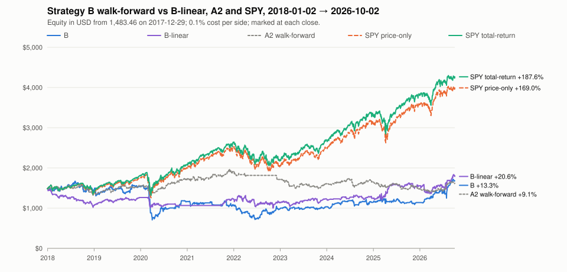

# Strategy B walk-forward (P6a), data through 2026-10-02

**P6a gate verdict:** Strategy B fails the P6a gate: walk-forward from 2018-01-02 to 2026-10-02 it returned +13.3% against +187.6% for total-return SPY, with profit factor 1.03 and max drawdown 57.6%, so it fails on beating total-return SPY, profit factor ≥ 1.3 and max drawdown ≤ 15%; Strategy B's one round has failed on this data, and P4 stays blocked.

## Data

- Data end (last bar loaded): 2026-10-02
- Bar rows loaded: 1,817,429
- Symbols with bars: 663
- Index members in the window with no bars at all: 115
- Candidate rows (every candidate on every data date 2015-10-16 → 2026-10-01): 1,304,876
- Labelled rows (a valid bracket and a label resolved by the data end): 1,304,243 (100.0%)

| Window | Dates | Sessions | USD/IDR at start | Starting cash (USD) |
|:---|:---|---:|---:|---:|
| Training data (anchored, longest window) | 2015-10-19 → 2025-12-31 | 2,566 | — | — |
| Walk-forward (traded) | 2018-01-02 → 2026-10-02 | 2,200 | 13,482.0000 | 1,483.46 |
| Seen before (a slice of the walk-forward) | 2022-01-03 → 2026-10-02 | 1,192 | — | — |

## Method

- **Strategy B** is a learned cross-sectional ranker (design §4). Each night it predicts the net return of A's design bracket for every candidate, and keeps the candidates with a positive prediction. Everything below was fixed before any B result was seen.
- **Candidates.** On each data date, every point-in-time S&P 500 ∪ Nasdaq-100 member with a bar dated that day, at least 200 bars through it, 20-session mean close × volume > $20,000,000 (A's liquidity floor), and all 15 per-symbol features defined. SPY is never a candidate, and a date where SPY's features are undefined has no candidates.
- **Features (18).** Per symbol, from its last 200 bars: `ret_1`, `ret_5`, `ret_20`, `ret_60`, `ret_120`, `close_sma50`, `close_sma200`, `rsi_2`, `rsi_14`, `atr_pct`, `stdev_20`, `dollar_volume_20`, `volume_5_20`, `gap`, `range_pos`. Each is turned into a cross-sectional rank in [0, 1] among that date's candidates, with ties averaged. Plus SPY's `spy_ret_5`, `spy_ret_20`, `spy_close_sma200`, raw and the same for every candidate on a date. Returns are over k bars. The 20-session stdev of daily returns uses ddof 0. RSI and ATR are Wilder's. The dollar-volume rank equals the rank of its log.
- **Bracket.** A's design bracket, fixed: limit = close − 0.5 × ATR(14), TP = limit + 1 × ATR(14), SL = limit − 1.5 × ATR(14), each to 4 dp. A candidate whose bracket is invalid is never picked and never trained on.
- **Label.** The net return per dollar committed of that one bracket order, simulated alone under design §5 on NYSE sessions. It fills only if the order session's low is below the limit, at min(open, limit). TP and SL are checked from the session after the fill, with SL first when both are in range. Gaps exit at the open. The time stop exits at the open once 5 sessions are held. Costs are 0.1% per side. An unfilled order labels 0. The labeler mirrors `seer_engine.sim`, and a test checks it against the simulator.
- **Label purge.** A label is resolved on its exit session, or on its order session if unfilled. Fold Y trains only on rows whose label resolved on or before the last session of Y − 1. A trade still open then is left out, so no fold learns from its own traded year.
- **B.** Gradient-boosted regression trees, `HistGradientBoostingRegressor(loss="squared_error", learning_rate=0.05, max_iter=300, max_leaf_nodes=15, min_samples_leaf=200, l2_regularization=1.0, early_stopping=False, random_state=0)`. There is no hyperparameter search. The model is retrained once per fold on that fold's purged rows.
- **B-linear (information only).** Ridge regression (alpha = 1.0, closed form, unpenalized intercept) on the same features, labels and folds, traded through the same walk-forward. It shows whether any edge comes from non-linearity or from the features alone. It is reported next to B, never gated, and never promotable on this data.
- **Picks.** Candidates are ranked by predicted label, descending, with the symbol breaking ties. Only predictions > 0 are kept, so the model may pass on a night. Every survivor gets A's bracket, and the simulator fills the free slots in that order.
- **Anchored yearly walk-forward (P3b's folds).** For each trade year Y, the fold trains on 2015-10-19 → the last session of Y − 1, then trades from the first session of Y to the last session of Y (or the data end). Folds: 2018, 2019, 2020, 2021, 2022, 2023, 2024, 2025, 2026. The traded years form one continuous portfolio from 2018-01-02. The model switches at each year boundary, and an order already placed keeps the bracket it was placed with.
- **Strategy A2 (information).** A2's combined walk-forward over the same folds, recomputed through the P3b pipeline, so that B, A2 and SPY sit on one chart. It is never gated here.
- **No look-ahead.** Picks for session S use bars through the previous session only, SPY's included. The universe is S&P 500 ∪ Nasdaq-100 members on that data date (point in time).
- **One simulator.** Every size, fill, exit and cost (0.1% per side, whole shares, 4 slots) comes from `seer_engine.sim`, unchanged. The walk-forward is one fresh portfolio of 20,000,000 IDR, converted at the USD/IDR rate of its first session. A held symbol whose bars end for good is closed at its last close (a forced `time` exit).
- **SPY benchmarks.** They start with the same cash on the session before the first traded session. They buy whole shares at the first session's open after the 0.1% cost, hold, and mark at each close. Price-only ignores dividends. Total-return reinvests each dividend at the ex-date close (whole shares, with cost). At the end, open positions and the SPY holding are both marked at the last close and never sold.
- **Metrics** follow `web/lib/metrics.ts`:
  - Total return = last / first equity − 1. Every curve starts at the starting cash on the session before its window.
  - A win is P/L > 0 and a loss is P/L ≤ 0. Profit factor = gross win / gross loss (∞ with no loss).
  - Max drawdown is measured on per-session equity. Months = calendar days / 30.44.
  - CAGR = (last / first)^(1 / years) − 1, with years = calendar days between the first and last snapshot / 365.25 (Actual/365.25).
  - Avg days held is the mean of the simulator's `days_held` over closed trades.
- **Diagnostics** explain the result and never feed any fit. They are P/L by exit reason and by exit year (net of costs), the trades with fewer than 3 shares, cost drag = Σ costs ÷ Σ gross P/L (both 0.1% sides), the share of nights the model passed, and a calibration table of mean prediction against mean realized label by prediction decile.
- **Gate (P6a).** Strategy B passes only if the gated curve beats total-return SPY over the same span, with profit factor ≥ 1.3 and max drawdown ≤ 15%. Nothing else decides it. The bar is high: total-return SPY made +187.6% over this span, with a 30.2% max drawdown of its own, and the gate asks for more return than that with at most a 15% drawdown.
- **Determinism probe.** The last fold's tree was fit twice on the same rows, once on one thread and once on the default thread count, and the two model digests are identical. So the pre-registered switch did not fire, and B (the tree model) is the gated model.
- **Seen before.** P3 already judged Strategy A v1 on the window from 2022-01-03 on, so that window is not out-of-sample any more. It is shown below only as a slice of the continuous curves, for information.
- **One round only.** Strategy B runs once on this data. If it fails the gate, B is not reworked on this data, and neither B-linear nor A2 can stand in for it.

## Training per fold

Each fold trains once, on the rows whose label resolved by the last session before its traded year. These numbers are in-fold. They explain the model and select nothing. Label mean and prediction mean are net returns per dollar committed. In-fold R² is information only ("—" when the labels are constant). Positive share is the share of training rows with a prediction > 0. Feature shares sum to 100% over all 18 features.

### B (gradient-boosted trees)

Top features by split-gain share.

| Year | Labels resolved through | Rows | Label mean | Pred mean | In-fold R² | Positive share | Top 5 features | Model digest |
|:---|:---|---:|---:|---:|---:|---:|:---|:---|
| 2018 | 2017-12-29 | 235,933 | +0.003% | +0.003% | +0.1110 | 53.1% | `spy_close_sma200` 26.3%, `spy_ret_5` 25.3%, `spy_ret_20` 24.1%, `atr_pct` 6.4%, `stdev_20` 3.0% | `4c162aa582b5` |
| 2019 | 2018-12-31 | 348,745 | −0.036% | −0.036% | +0.1239 | 44.6% | `spy_ret_5` 33.6%, `spy_close_sma200` 28.1%, `spy_ret_20` 25.6%, `atr_pct` 4.1%, `stdev_20` 1.7% | `8584890e50e0` |
| 2020 | 2019-12-31 | 464,379 | −0.014% | −0.014% | +0.1064 | 45.6% | `spy_ret_5` 36.5%, `spy_close_sma200` 27.5%, `spy_ret_20` 25.8%, `atr_pct` 3.4%, `stdev_20` 1.4% | `cce79e393c49` |
| 2021 | 2020-12-31 | 584,652 | +0.008% | +0.008% | +0.1831 | 47.3% | `spy_ret_5` 36.4%, `spy_ret_20` 25.2%, `spy_close_sma200` 21.6%, `atr_pct` 5.1%, `ret_5` 2.4% | `7a2ffa71577d` |
| 2022 | 2021-12-31 | 707,039 | +0.012% | +0.012% | +0.1573 | 49.4% | `spy_ret_5` 34.7%, `spy_ret_20` 26.4%, `spy_close_sma200` 21.0%, `atr_pct` 4.9%, `ret_5` 2.7% | `ce7899aff577` |
| 2023 | 2022-12-30 | 830,438 | −0.011% | −0.011% | +0.1463 | 46.3% | `spy_ret_5` 30.5%, `spy_close_sma200` 30.4%, `spy_ret_20` 26.1%, `atr_pct` 4.3%, `ret_5` 2.0% | `c1dacf10fb96` |
| 2024 | 2023-12-29 | 955,311 | −0.010% | −0.010% | +0.1318 | 42.5% | `spy_ret_5` 33.9%, `spy_close_sma200` 29.6%, `spy_ret_20` 23.5%, `atr_pct` 4.5%, `ret_5` 2.1% | `e15bbd0420d6` |
| 2025 | 2024-12-31 | 1,080,744 | −0.012% | −0.012% | +0.1219 | 43.8% | `spy_ret_5` 34.3%, `spy_ret_20` 27.2%, `spy_close_sma200` 25.5%, `atr_pct` 4.3%, `ret_5` 2.1% | `b9fe6ae2f103` |
| 2026 | 2025-12-31 | 1,207,705 | −0.009% | −0.009% | +0.1131 | 40.2% | `spy_ret_5` 33.7%, `spy_close_sma200` 30.6%, `spy_ret_20` 23.4%, `atr_pct` 4.2%, `ret_5` 2.1% | `19f8cf523850` |

### B-linear (ridge regression)

Top features by |coefficient| × feature std share.

| Year | Labels resolved through | Rows | Label mean | Pred mean | In-fold R² | Positive share | Top 5 features | Model digest |
|:---|:---|---:|---:|---:|---:|---:|:---|:---|
| 2018 | 2017-12-29 | 235,933 | +0.003% | +0.003% | +0.0019 | 44.2% | `ret_120` 19.9%, `spy_ret_20` 18.5%, `spy_close_sma200` 16.2%, `close_sma200` 14.1%, `close_sma50` 7.4% | `c8f9261dfd4e` |
| 2019 | 2018-12-31 | 348,745 | −0.036% | −0.036% | +0.0011 | 23.4% | `spy_close_sma200` 18.6%, `ret_120` 18.1%, `close_sma200` 10.6%, `spy_ret_20` 7.2%, `ret_1` 6.2% | `160218dd2dd2` |
| 2020 | 2019-12-31 | 464,379 | −0.014% | −0.014% | +0.0026 | 33.9% | `spy_close_sma200` 33.8%, `ret_120` 12.9%, `spy_ret_5` 8.4%, `close_sma200` 6.2%, `close_sma50` 5.9% | `15de2702ee0f` |
| 2021 | 2020-12-31 | 584,652 | +0.008% | +0.008% | +0.0033 | 44.5% | `spy_close_sma200` 39.6%, `spy_ret_20` 14.3%, `ret_120` 8.3%, `ret_5` 7.6%, `close_sma50` 5.3% | `74a9ffb62df8` |
| 2022 | 2021-12-31 | 707,039 | +0.012% | +0.012% | +0.0020 | 53.4% | `spy_close_sma200` 37.1%, `spy_ret_20` 9.7%, `ret_5` 9.7%, `ret_120` 9.6%, `rsi_14` 7.5% | `fd23f958eae4` |
| 2023 | 2022-12-30 | 830,438 | −0.011% | −0.011% | +0.0012 | 38.5% | `spy_close_sma200` 25.0%, `rsi_14` 13.9%, `ret_5` 9.9%, `ret_120` 8.0%, `spy_ret_5` 5.9% | `bf623fd0c670` |
| 2024 | 2023-12-29 | 955,311 | −0.010% | −0.010% | +0.0013 | 38.6% | `spy_close_sma200` 24.4%, `rsi_14` 13.0%, `ret_120` 8.3%, `ret_5` 8.0%, `spy_ret_20` 7.4% | `bb5b152729c8` |
| 2025 | 2024-12-31 | 1,080,744 | −0.012% | −0.012% | +0.0012 | 37.4% | `spy_close_sma200` 24.1%, `rsi_14` 15.7%, `ret_5` 8.9%, `ret_120` 6.4%, `spy_ret_5` 5.7% | `d130cad68190` |
| 2026 | 2025-12-31 | 1,207,705 | −0.009% | −0.009% | +0.0014 | 39.0% | `spy_close_sma200` 24.9%, `rsi_14` 14.9%, `ret_5` 8.0%, `spy_ret_5` 6.7%, `ret_1` 6.6% | `7d52c6cca9dc` |

## Walk-forward results

One continuous portfolio over every traded year, per curve. Each year traded the model its fold trained, and no year's numbers fed any fit. The gated column is the evidence the gate reads. The other curves are information.

### Walk-forward vs SPY (2018-01-02 → 2026-10-02, 2,200 sessions)

| Metric | B (gated) | B-linear | A2 walk-forward | SPY price-only | SPY total-return |
|:---|---:|---:|---:|---:|---:|
| Ending equity (USD) | 1,680.03 | 1,788.95 | 1,618.60 | 3,991.12 | 4,266.20 |
| Total return | +13.3% | +20.6% | +9.1% | +169.0% | +187.6% |
| CAGR | +1.4% | +2.2% | +1.0% | +12.0% | +12.8% |
| Win rate | 56.0% | 54.4% | 58.3% | — | — |
| Profit factor | 1.03 | 1.05 | 1.02 | — | — |
| Max drawdown | 57.6% | 32.4% | 29.1% | 31.4% | 30.2% |
| Trades (closed) | 1095 | 1182 | 1329 | — | — |
| Avg days held | 3.62 | 3.45 | 3.39 | — | — |
| Exits: take profit | 475 | 512 | 634 | — | — |
| Exits: stop loss | 172 | 267 | 244 | — | — |
| Exits: time stop | 390 | 331 | 376 | — | — |
| Exits: gap at the open | 58 | 72 | 75 | — | — |
| Forced closes (bars ended; inside time stop) | 0 | 0 | 0 | — | — |
| Open at end | 0 | 2 | 3 | — | — |
| Months | 105.1 | 105.1 | 105.1 | 105.1 | 105.1 |
| SPY shares at end | — | — | — | 5 | 5 |
| SPY dividends credited (USD) | — | — | — | — | 275.08 |
| Meets the gate's rules | no: Beats SPY, Profit factor ≥ 1.3, Max drawdown ≤ 15% | no: Beats SPY, Profit factor ≥ 1.3, Max drawdown ≤ 15% | no: Beats SPY, Profit factor ≥ 1.3, Max drawdown ≤ 15% | — | — |

Picks the simulator rejected:

- B (gated): held 2,127, lt_one_share 504, no_slot 458,605.
- B-linear: held 2,666, lt_one_share 461, no_slot 332,566.
- A2 walk-forward: held 1,567, lt_one_share 380, no_slot 50,682.

## Year by year

Each traded year's return, from the close before its first session to its last close.

| Year | Traded | B (gated) | B-linear | A2 walk-forward | SPY price-only | SPY total-return |
|:---|:---|---:|---:|---:|---:|---:|
| 2018 | 2018-01-02 → 2018-12-31 | −2.9% | −27.8% | −8.7% | −6.1% | −4.4% |
| 2019 | 2019-01-02 → 2019-12-31 | +6.3% | +18.0% | +14.9% | +25.8% | +27.3% |
| 2020 | 2020-01-02 → 2020-12-31 | −23.9% | −15.7% | +9.8% | +14.8% | +16.0% |
| 2021 | 2021-01-04 → 2021-12-31 | −8.4% | +15.4% | +11.8% | +25.1% | +25.5% |
| 2022 | 2022-01-03 → 2022-12-30 | −7.3% | −6.6% | −10.3% | −18.4% | −16.4% |
| 2023 | 2023-01-03 → 2023-12-29 | +4.8% | +7.2% | −6.1% | +22.6% | +22.6% |
| 2024 | 2024-01-02 → 2024-12-31 | +10.5% | +0.5% | +2.8% | +22.0% | +21.9% |
| 2025 | 2025-01-02 → 2025-12-31 | −0.5% | +25.8% | −10.8% | +15.6% | +15.7% |
| 2026 | 2026-01-02 → 2026-10-02 | +47.4% | +14.9% | +9.8% | +12.3% | +12.3% |

## Diagnostics

These numbers explain the result. They never feed a fit. P/L is net of both 0.1% costs. Gross P/L is (exit − fill) × shares. Cost drag is "—" when gross P/L is zero or negative. A night is passed when the model kept no candidate: none had a valid bracket and a prediction > 0. Zero picks is allowed (design §5).

| Measure | B (gated) | B-linear |
|:---|---:|---:|
| Trades (closed) | 1095 | 1182 |
| Trades with < 3 shares | 358 (32.7%) | 497 (42.0%) |
| Gross P/L (USD) | +769.60 | +953.29 |
| Costs (USD) | 573.03 | 630.13 |
| Net P/L (USD) | +196.58 | +323.16 |
| Cost drag (costs ÷ gross P/L) | 74.5% | 66.1% |
| Nights passed (no pick) | 645 of 2,200 (29.3%) | 527 of 2,200 (24.0%) |

### P/L by exit reason (trades · USD)

| Exit | B (gated) | B-linear |
|:---|---:|---:|
| Exits: take profit | 475 · +6,605.43 | 512 · +5,826.88 |
| Exits: stop loss | 172 · −3,289.71 | 267 · −3,700.04 |
| Exits: time stop | 390 · −1,491.86 | 331 · −441.64 |
| Exits: gap at the open | 58 · −1,627.30 | 72 · −1,362.05 |

### P/L by exit year (trades · USD)

| Year | B (gated) | B-linear |
|:---|---:|---:|
| 2018 | 158 · −38.86 | 198 · −420.42 |
| 2019 | 139 · +91.31 | 170 · +201.16 |
| 2020 | 121 · −371.12 | 86 · −198.32 |
| 2021 | 122 · −78.88 | 33 · +159.33 |
| 2022 | 159 · −104.35 | 188 · −91.34 |
| 2023 | 124 · +54.43 | 156 · +98.83 |
| 2024 | 96 · +116.46 | 86 · +10.84 |
| 2025 | 103 · −12.64 | 155 · +314.01 |
| 2026 | 73 · +540.22 | 110 · +249.09 |

### Calibration: B

Every candidate with a valid bracket on a traded session's data date, predicted out of sample by that year's fold model, with its label resolved by the data end. Sorted by prediction and split into 10 groups of (almost) equal size. Mean prediction against mean realized label shows whether the ranking carries information. It explains and never selects.

| Decile | Rows | Prediction range | Mean prediction | Mean realized label |
|---:|---:|:---|---:|---:|
| 1 | 106,793 | −9.708% to −0.491% | −1.184% | +0.006% |
| 2 | 106,793 | −0.491% to −0.230% | −0.329% | +0.046% |
| 3 | 106,793 | −0.230% to −0.121% | −0.169% | −0.095% |
| 4 | 106,793 | −0.121% to −0.070% | −0.095% | −0.097% |
| 5 | 106,793 | −0.070% to −0.026% | −0.046% | −0.036% |
| 6 | 106,793 | −0.026% to +0.014% | −0.006% | +0.000% |
| 7 | 106,793 | +0.014% to +0.057% | +0.035% | −0.009% |
| 8 | 106,792 | +0.057% to +0.135% | +0.091% | −0.013% |
| 9 | 106,792 | +0.135% to +0.326% | +0.214% | −0.076% |
| 10 | 106,792 | +0.326% to +5.252% | +0.773% | +0.158% |

### Calibration: B-linear

Every candidate with a valid bracket on a traded session's data date, predicted out of sample by that year's fold model, with its label resolved by the data end. Sorted by prediction and split into 10 groups of (almost) equal size. Mean prediction against mean realized label shows whether the ranking carries information. It explains and never selects.

| Decile | Rows | Prediction range | Mean prediction | Mean realized label |
|---:|---:|:---|---:|---:|
| 1 | 106,793 | −0.422% to −0.162% | −0.220% | +0.005% |
| 2 | 106,793 | −0.162% to −0.110% | −0.132% | −0.030% |
| 3 | 106,793 | −0.110% to −0.084% | −0.096% | −0.027% |
| 4 | 106,793 | −0.084% to −0.063% | −0.073% | −0.022% |
| 5 | 106,793 | −0.063% to −0.042% | −0.053% | −0.027% |
| 6 | 106,793 | −0.042% to −0.021% | −0.032% | −0.024% |
| 7 | 106,793 | −0.021% to +0.005% | −0.009% | −0.048% |
| 8 | 106,792 | +0.005% to +0.045% | +0.023% | −0.027% |
| 9 | 106,792 | +0.045% to +0.146% | +0.086% | −0.132% |
| 10 | 106,792 | +0.146% to +0.634% | +0.244% | +0.215% |

## Seen before (information only, not out-of-sample)

P3 judged Strategy A v1 on the window from 2022-01-03 on. Because that window has been looked at, it is not out-of-sample any more. These rows are a slice of the same continuous curves (2022-01-03 → 2026-10-02, 1,192 sessions, measured from the close before), not a fresh portfolio. They are information only and never feed the gate.

| Curve | Total return | CAGR | Win rate | Profit factor | Max drawdown | Trades |
|:---|---:|---:|---:|---:|---:|---:|
| B (gated) | +57.5% | +10.0% | 54.8% | 1.20 | 33.3% | 555 |
| B-linear | +45.5% | +8.2% | 54.7% | 1.15 | 23.8% | 695 |
| A2 walk-forward | −15.2% | −3.4% | 54.5% | 0.91 | 27.2% | 668 |
| SPY price-only | +58.5% | +10.2% | — | — | 23.9% | — |
| SPY total-return | +62.3% | +10.7% | — | — | 22.1% | — |

## Go-live checklist (what a backtest can evaluate)

These are design §1's fixed rules, computed exactly as the web computes them, on the gated curve. The "months forward" and "100 trades" items need forward paper trading, so here they are information only. "Beats SPY" compares with total-return SPY. Only the walk-forward column is evidence; the seen-before column is information.

| Item | Design §1 | Walk-forward, B (2018-01-02 → 2026-10-02) | Seen before (information) |
|:---|:---|:---|:---|
| ≥ 3 months forward | #1, forward-only: information | pass: 105.0 mo | pass: 57.0 mo |
| ≥ 100 trades | #1, forward-only: information | pass: 1095 / 100 | pass: 555 / 100 |
| Beats SPY | #2, in the gate (vs total-return SPY) | fail: +13.3 vs +187.6 | fail: +57.5 vs +62.3 |
| Profit factor ≥ 1.3 | #3, in the gate | fail: 1.03 | fail: 1.20 |
| Max drawdown ≤ 15% | #4, in the gate | fail: 57.6% | fail: 33.3% |
| Passed a 10-year backtest under identical rules | #5, decided by the P6a gate | fail: P6a gate verdict | — |

## Survivorship bias

This walk-forward can only train on and trade stocks that still have price data. 115 stocks were in the S&P 500 or the Nasdaq-100 at some point from 2015-10-19 to 2026-10-02, but they have no price data at all. They were delisted or bought out, and the free data source no longer serves them.

On the days they were index members, Strategy B could not see them, in training or in trading. **A learned model is more exposed to this than a rule.** Its training labels come only from survivors, so the losers it never saw are exactly the ones it would have needed to learn to avoid, and it can absorb the bias into what it learns. **These results are therefore probably better than reality**, by an amount this data cannot measure.

The table counts, per year, the (member, session) pairs with no bar:

- "Never fetched" are members with no bars at all.
- "Other" are members that have bars elsewhere but none on that session, such as halts or the days before a listing.

| Year | Member-sessions | Missing | Never fetched | Other | Missing share |
|:---|---:|---:|---:|---:|---:|
| 2015 | 27,382 | 6,078 | 4,911 | 1,167 | 22.20% |
| 2016 | 133,339 | 26,299 | 21,690 | 4,609 | 19.72% |
| 2017 | 131,396 | 21,315 | 18,047 | 3,268 | 16.22% |
| 2018 | 131,497 | 18,413 | 15,840 | 2,573 | 14.00% |
| 2019 | 131,191 | 14,280 | 12,506 | 1,774 | 10.88% |
| 2020 | 132,794 | 11,969 | 10,704 | 1,265 | 9.01% |
| 2021 | 132,785 | 10,108 | 8,848 | 1,260 | 7.61% |
| 2022 | 132,264 | 7,876 | 6,832 | 1,044 | 5.95% |
| 2023 | 130,471 | 5,487 | 4,686 | 801 | 4.21% |
| 2024 | 130,865 | 4,137 | 3,381 | 756 | 3.16% |
| 2025 | 129,370 | 2,618 | 1,867 | 751 | 2.02% |
| 2026 | 97,750 | 697 | 241 | 456 | 0.71% |
| All | 1,441,104 | 129,277 | 109,553 | 19,724 | 8.97% |

## Open positions at end

Positions still live after the last session are marked at that close and never sold, the same treatment as the SPY holding.

### B

None.

### B-linear

| Symbol | Status | Slot | Session | Filled | Fill price | Shares | Limit | TP | SL | Days held |
|:---|:---|---:|:---|:---|---:|---:|---:|---:|---:|---:|
| AXON | open | 1 | 2026-09-28 | 2026-09-28 | 417.6200 | 1 | 417.6200 | 442.6001 | 380.1499 | 5 |
| ALNY | open | 2 | 2026-10-02 | 2026-10-02 | 225.9836 | 2 | 225.9836 | 236.3764 | 210.3944 | 1 |

### A2 walk-forward

| Symbol | Status | Slot | Session | Filled | Fill price | Shares | Limit | TP | SL | Days held |
|:---|:---|---:|:---|:---|---:|---:|---:|---:|---:|---:|
| CB | open | 1 | 2026-09-28 | 2026-09-28 | 330.8642 | 1 | 330.8642 | 335.8758 | 323.3468 | 5 |
| GL | open | 2 | 2026-10-01 | 2026-10-01 | 164.0539 | 2 | 164.0539 | 167.2462 | 159.2655 | 2 |
| ELV | open | 4 | 2026-09-30 | 2026-09-30 | 388.0052 | 1 | 388.0052 | 397.4549 | 373.8307 | 3 |

## Equity curves



The daily values of every curve are in [`2026-10-02-strategy-b-walkforward-equity.csv`](2026-10-02-strategy-b-walkforward-equity.csv). Per-date predictions are not published: there are about a million of them, and the calibration tables above summarize them.

## Gate verdict

Strategy B fails the P6a gate: walk-forward from 2018-01-02 to 2026-10-02 it returned +13.3% against +187.6% for total-return SPY, with profit factor 1.03 and max drawdown 57.6%, so it fails on beating total-return SPY, profit factor ≥ 1.3 and max drawdown ≤ 15%; Strategy B's one round has failed on this data, and P4 stays blocked.

- Beats SPY: fail (+13.3 vs +187.6)
- Profit factor ≥ 1.3: fail (1.03)
- Max drawdown ≤ 15%: fail (57.6%)

## If the gate failed: what the owner decides next

Strategy B had one round on this data, and it failed. B is not reworked on this data, and P4 stays blocked. What was tried, all of it fixed before any result: one gradient-boosted tree model with fixed hyperparameters and no search, retrained per fold on purged, net-of-cost labels over 18 generic features, with A's design bracket and a positive-prediction threshold; ridge regression (B-linear) beside it as information; and a pre-registered determinism switch between them. What happens next is the owner's decision, not this report's. The remaining options are:

- **(b)** Accept SPY buy-and-hold as the honest champion for now. Seer can still paper-trade research strategies (P4 without real-money picks), and the home screen recommends no buys.
- **(c)** Revisit a design §5 trade rule, for example the 5-day time stop, the 4 slots, or a longer holding horizon. That is a design change, so it needs the owner's explicit decision and a new handover. It is never done inside a strategy phase.
- **(d)** Strategy C (news + LLM veto) is forward-paper only by design §4, so it cannot pass a backtest gate. It does not unblock P4 under the current ROADMAP wording, and changing that wording is the owner's call.

## Machine-readable lines

The last fold (2026) trained the gated model (B) on 1,207,705 rows with labels resolved through 2025-12-31. Its digest is `19f8cf523850c575350a750ae9ca1d2189de036debff713b502ff4ea79bb1aa3`. If the gate passes, that model is the one to freeze. The `last-fold-model` line is its retrain recipe (training cut-off, row count and label sum): a re-fit from the same rows on the pinned scikit-learn reproduces it bit for bit.

Frozen in code (`STRATEGY_B_FROZEN`): none. The gate failed, so nothing is deployed and no model artifact is written.

`tests/test_strategy_b_frozen.py` reads these four lines.

```text
p6a-gate: failed
gated-model: B
last-fold-model: {"kind": "tree", "digest": "19f8cf523850c575350a750ae9ca1d2189de036debff713b502ff4ea79bb1aa3", "train_end": "2025-12-31", "rows": 1207705, "label_sum": "-108.61612239607506"}
frozen-model: null
```
