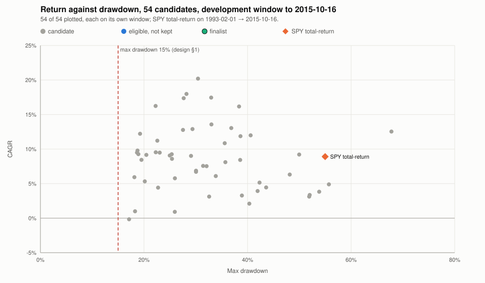

# P7a development-window exploration (data through 2015-10-16)

**D8 result:** none of the 54 candidates is eligible on the development window. **P7b does not run.** The frontier below is the evidence for the owner's next decision.

No number in this report comes from a session after 2015-10-16 (handover D9).

## Data

The research store (`engine/.research/`, local and gitignored, never Neon; handover D5) is built by `python -m seer_engine research_store` and verified against its manifest on load.

- Store fingerprint: `5451195fd552e208eaadfc6bc89241b9b8e3e6ccb0f4c447a84bbc4f32e7d90a`
- Bar rows: 2,490,793
- Symbols requested from yfinance: 1,061
- Symbols served: 539
- Dividend rows: 28,206
- USD/IDR rows: 4,300
- Every bar, dividend and FX row in the store is dated on or before 2015-10-16.
- S&P 500 membership from 1996-01-02 and Nasdaq-100 membership from 2007-02-01, point in time (`engine/data/`).
- Symbols yfinance returned nothing for: 522 (listed under Survivorship bias).

## Method

**Protocol** (handover §3, fixed before any result existed):

- **D1, split.** P7a explores on the development window only and ends with a pre-registration file naming at most 3 finalists. P7b runs those finalists once on the test window and applies the gate. No candidate here ran on the test window.
- **D3, windows.** A candidate's window starts at the first NYSE session where every instrument it reads has enough bars for its lookback through the previous session; a candidate that trades index members also needs a data date on or after 1996-01-02. Every window ends 2015-10-16. Each candidate's own window is in its row; the earliest start is 1993-02-01.
- **D6, registry.** Every candidate is fixed in `engine/src/seer_engine/backtest/registry.py`, committed before this run, append-only, at most 60 entries, with fixed parameters. sha256 of that file for this run: `110abce5a77205e367b09d3ffb9dcb112a9e470f7f455dc6841076137813b5a4`.
- **D7, every try reported.** One row per registry candidate, none hidden. Trials: 54.
- **D8, finalists.** Eligible: beats SPY total-return over its own development window, max drawdown ≤ 15%, profit factor ≥ 1.3, ≥ 100 closed trades, and no owner input (Gotrade-executable under the conservative defaults). Ranked by MAR = CAGR ÷ max drawdown, highest first, ties by candidate id. The top 3 are kept, at most one per family.
- **D9, test window untouched.** The dev runner refuses any session after 2015-10-16, and the store holds no row after it.

**Simulation:**

- Each candidate starts a fresh book of 20,000,000 IDR, converted to USD once at the USD/IDR rate on the later of its start and 1999-01-04. Everything after that is USD.
- Rule sets on engine `book` run on `seer_engine.sim.book`. `design-v0` runs on the unchanged design-§5 simulator (`run_backtest`). Cost per side, dividends, cadence and entry are as each rule set says (below).
- SPY benchmarks: `benchmark.spy_curves` on each candidate's own window and starting cash, with SPY dividends from the research store. Price-only ignores dividends; total-return reinvests them.

**Metrics:**

- Return = last / first equity − 1. CAGR uses Actual/365.25. Max drawdown is measured on per-session equity.
- A closed trade is one holding episode (shares 0 → > 0 → 0), dividends included in its P/L. Trims, adds and idle-instrument episodes are not trades. Profit factor = gross win / gross loss over closed trades.
- Exposure = mean over sessions of invested value (idle instrument excluded) / equity. Turnover = traded notional / mean equity, per year. Cost drag = costs / gross P/L before costs (a dash when gross P/L ≤ 0).
- Worst year: the lowest calendar-year return (last close of a year over the last close of the year before, or over the starting cash).

**Rule sets used** (`seer_engine.sim.rules.describe_rules`):

- `monthly-hold`, used by 29 candidates:
  - Rule set: monthly-hold.
  - Engine: the target-weight book; a position the strategy stops wanting is sold at the next open, and stops and take-profits are fixed at entry.
  - Decisions: the first session of each calendar month, from the previous session's close.
  - Entry: a buy limit at the last close + 2% for the next session; it fills only when the low trades below the limit, at the lower of the open and the limit.
  - Positions: as many as the strategy targets.
  - Time stop: none.
  - Rebalance: on decision sessions, a held position is traded back to its target weight at the open when it is off by at least 1% of equity.
  - Shares: whole shares only.
  - Dividends: cash dividends are credited on the ex-date.
  - Idle cash: held as cash, earning nothing.
  - Costs: 0.1% per side.
- `design-v0`, used by 1 candidate:
  - Rule set: design-v0.
  - Engine: the design §5 bracket simulator, unchanged.
  - Decisions: every session, from the previous session's close.
  - Entry: a buy limit at the strategy's limit price for the next session; it fills only when the low trades below the limit, at the lower of the open and the limit.
  - Positions: at most 4 at a time (the idle instrument not counted).
  - Time stop: sell at the next open once a position has been held 5 sessions.
  - Rebalance: none; a held position keeps its shares until it exits.
  - Shares: whole shares only.
  - Dividends: not credited.
  - Idle cash: held as cash, earning nothing.
  - Costs: 0.1% per side.
- `daily-switch`, used by 11 candidates:
  - Rule set: daily-switch.
  - Engine: the target-weight book; a position the strategy stops wanting is sold at the next open, and stops and take-profits are fixed at entry.
  - Decisions: every session, from the previous session's close.
  - Entry: a buy limit at the last close + 2% for the next session; it fills only when the low trades below the limit, at the lower of the open and the limit.
  - Positions: as many as the strategy targets.
  - Time stop: none.
  - Rebalance: none; a held position keeps its shares until it exits.
  - Shares: whole shares only.
  - Dividends: cash dividends are credited on the ex-date.
  - Idle cash: held as cash, earning nothing.
  - Costs: 0.1% per side.
- `daily-switch-tbill`, used by 1 candidate:
  - Rule set: daily-switch-tbill.
  - Engine: the target-weight book; a position the strategy stops wanting is sold at the next open, and stops and take-profits are fixed at entry.
  - Decisions: every session, from the previous session's close.
  - Entry: a buy limit at the last close + 2% for the next session; it fills only when the low trades below the limit, at the lower of the open and the limit.
  - Positions: as many as the strategy targets.
  - Time stop: none.
  - Rebalance: none; a held position keeps its shares until it exits.
  - Shares: whole shares only.
  - Dividends: cash dividends are credited on the ex-date.
  - Idle cash: the unallocated weight is held in BIL on decision sessions.
  - Costs: 0.1% per side.
- `weekly-hold`, used by 4 candidates:
  - Rule set: weekly-hold.
  - Engine: the target-weight book; a position the strategy stops wanting is sold at the next open, and stops and take-profits are fixed at entry.
  - Decisions: the first session of each ISO week, from the previous session's close.
  - Entry: a buy limit at the last close + 2% for the next session; it fills only when the low trades below the limit, at the lower of the open and the limit.
  - Positions: as many as the strategy targets.
  - Time stop: none.
  - Rebalance: on decision sessions, a held position is traded back to its target weight at the open when it is off by at least 1% of equity.
  - Shares: whole shares only.
  - Dividends: cash dividends are credited on the ex-date.
  - Idle cash: held as cash, earning nothing.
  - Costs: 0.1% per side.
- `swing-t20`, used by 6 candidates:
  - Rule set: swing-t20.
  - Engine: the target-weight book; a position the strategy stops wanting is sold at the next open, and stops and take-profits are fixed at entry.
  - Decisions: every session, from the previous session's close.
  - Entry: a buy limit at the strategy's limit price for the next session; it fills only when the low trades below the limit, at the lower of the open and the limit. A new position the strategy gives no limit price is bought at a limit of the last close + 2% instead, filled the same way.
  - Positions: as many as the strategy targets.
  - Time stop: sell at the next open once a position has been held 20 sessions.
  - Rebalance: none; a held position keeps its shares until it exits.
  - Shares: whole shares only.
  - Dividends: cash dividends are credited on the ex-date.
  - Idle cash: held as cash, earning nothing.
  - Costs: 0.1% per side.
- `swing-t10`, used by 1 candidate:
  - Rule set: swing-t10.
  - Engine: the target-weight book; a position the strategy stops wanting is sold at the next open, and stops and take-profits are fixed at entry.
  - Decisions: every session, from the previous session's close.
  - Entry: a buy limit at the strategy's limit price for the next session; it fills only when the low trades below the limit, at the lower of the open and the limit. A new position the strategy gives no limit price is bought at a limit of the last close + 2% instead, filled the same way.
  - Positions: as many as the strategy targets.
  - Time stop: sell at the next open once a position has been held 10 sessions.
  - Rebalance: none; a held position keeps its shares until it exits.
  - Shares: whole shares only.
  - Dividends: cash dividends are credited on the ex-date.
  - Idle cash: held as cash, earning nothing.
  - Costs: 0.1% per side.
- `swing-t20-open`, used by 1 candidate:
  - Rule set: swing-t20-open.
  - Engine: the target-weight book; a position the strategy stops wanting is sold at the next open, and stops and take-profits are fixed at entry.
  - Decisions: every session, from the previous session's close.
  - Entry: a buy limit at the last close + 2% for the next session; it fills only when the low trades below the limit, at the lower of the open and the limit.
  - Positions: as many as the strategy targets.
  - Time stop: sell at the next open once a position has been held 20 sessions.
  - Rebalance: none; a held position keeps its shares until it exits.
  - Shares: whole shares only.
  - Dividends: cash dividends are credited on the ex-date.
  - Idle cash: held as cash, earning nothing.
  - Costs: 0.1% per side.

## Candidates

The registry in order, exactly as run. A candidate with owner inputs needs the owner to verify a Gotrade feature first, so it cannot be a finalist (D8).

| # | ID | Family | Allocator | Rules | Parameters | Owner inputs | Added | Rationale |
|---:|:---|:---|:---|:---|:---|:---|:---|:---|
| 1 | `REF-SPY-HOLD` | REF | `F1` | `monthly-hold` | `{"hold": "SPY", "signal": "SPY", "rule": "always", "n": "1"}` | none | 2026-10-04 | Sanity reference: SPY held with dividends should track SPY TR minus whole-share cash drag |
| 2 | `REF-A-V0` | REF | `A` | `design-v0` | `{"rsi_max": "10", "limit_atr": "0.5", "tp_atr": "1", "sl_atr": "1.5", "min_dollar_volume": "20000000"}` | none | 2026-10-04 | A's idea under the closed §5 rules on fresh data: is A's failure specific to 2015–2026? |
| 3 | `F1-SPY-SMA200-D` | F1 | `F1` | `daily-switch` | `{"hold": "SPY", "signal": "SPY", "rule": "sma", "n": "200"}` | none | 2026-10-04 | The classic drawdown cutter, checked nightly |
| 4 | `F1-SPY-SMA200-M` | F1 | `F1` | `monthly-hold` | `{"hold": "SPY", "signal": "SPY", "rule": "sma", "n": "200"}` | none | 2026-10-04 | Same signal, monthly: fewer whipsaws |
| 5 | `F1-SPY-SMA100-D` | F1 | `F1` | `daily-switch` | `{"hold": "SPY", "signal": "SPY", "rule": "sma", "n": "100"}` | none | 2026-10-04 | A faster filter cuts crashes sooner |
| 6 | `F1-SPY-SMA50-D` | F1 | `F1` | `daily-switch` | `{"hold": "SPY", "signal": "SPY", "rule": "sma", "n": "50"}` | none | 2026-10-04 | Fastest filter; more trades, more whipsaw |
| 7 | `F1-SPY-10MSMA-M` | F1 | `F1` | `monthly-hold` | `{"hold": "SPY", "signal": "SPY", "rule": "month_sma", "n": "10"}` | none | 2026-10-04 | Faber's 10-month rule |
| 8 | `F1-SPY-ABS12-M` | F1 | `F1` | `monthly-hold` | `{"hold": "SPY", "signal": "SPY", "rule": "abs_mom", "n": "252"}` | none | 2026-10-04 | 12-month absolute momentum (vs 0, T-bills unavailable by default) |
| 9 | `F1-SPY-SMA200-D-TBILL` | F1 | `F1` | `daily-switch-tbill` | `{"hold": "SPY", "signal": "SPY", "rule": "sma", "n": "200"}` | etf:BIL | 2026-10-04 | Idle cash in T-bills (BIL from 2007) |
| 10 | `F1-QQQ-SMA200-D` | F1 | `F1` | `daily-switch` | `{"hold": "QQQ", "signal": "QQQ", "rule": "sma", "n": "200"}` | none | 2026-10-04 | Tech-led index adds return in bull eras |
| 11 | `F1-QQQ-SMA200-M` | F1 | `F1` | `monthly-hold` | `{"hold": "QQQ", "signal": "QQQ", "rule": "sma", "n": "200"}` | none | 2026-10-04 | Monthly variant |
| 12 | `F1-QQQ-SMA100-D` | F1 | `F1` | `daily-switch` | `{"hold": "QQQ", "signal": "QQQ", "rule": "sma", "n": "100"}` | none | 2026-10-04 | QQQ's faster crashes need a faster filter |
| 13 | `F1-QQQ-SPYSIG-D` | F1 | `F1` | `daily-switch` | `{"hold": "QQQ", "signal": "SPY", "rule": "sma", "n": "200"}` | none | 2026-10-04 | Hold QQQ, time on the broader market |
| 14 | `F1-QQQ-10MSMA-M` | F1 | `F1` | `monthly-hold` | `{"hold": "QQQ", "signal": "QQQ", "rule": "month_sma", "n": "10"}` | none | 2026-10-04 | 10-month rule on QQQ |
| 15 | `F1-SPY-VT12-W` | F1 | `VOLTARGET` | `weekly-hold` | `{"inner": "F1", "signal": "SPY", "target_vol": "0.12", "n": "20", "inner.hold": "SPY", "inner.signal": "SPY", "inner.rule": "sma", "inner.n": "200"}` | none | 2026-10-04 | Trend filter plus 12% vol targeting |
| 16 | `F1-QQQ-VT15-W` | F1 | `VOLTARGET` | `weekly-hold` | `{"inner": "F1", "signal": "QQQ", "target_vol": "0.15", "n": "20", "inner.hold": "QQQ", "inner.signal": "QQQ", "inner.rule": "sma", "inner.n": "200"}` | none | 2026-10-04 | QQQ with 15% vol targeting |
| 17 | `F10-SSO-SMA200-D` | F10 | `F1` | `daily-switch` | `{"hold": "SSO", "signal": "SPY", "rule": "sma", "n": "200"}` | etf:SSO, leverage | 2026-10-04 | 2× S&P only above trend (owner: leverage) |
| 18 | `F10-QLD-SMA200-D` | F10 | `F1` | `daily-switch` | `{"hold": "QLD", "signal": "QQQ", "rule": "sma", "n": "200"}` | etf:QLD, leverage | 2026-10-04 | 2× Nasdaq only above trend (owner: leverage) |
| 19 | `F10-SSO-10MSMA-M` | F10 | `F1` | `monthly-hold` | `{"hold": "SSO", "signal": "SPY", "rule": "month_sma", "n": "10"}` | etf:SSO, leverage | 2026-10-04 | Leveraged 10-month rule |
| 20 | `F11-SPY-TOM` | F11 | `F11` | `daily-switch` | `{"hold": "SPY", "days_before": "1", "days_after": "3", "trend": "none"}` | none | 2026-10-04 | Turn-of-month effect: low exposure, low DD |
| 21 | `F11-SPY-TOM-TREND` | F11 | `F11` | `daily-switch` | `{"hold": "SPY", "days_before": "1", "days_after": "3", "trend": "SPY:200"}` | none | 2026-10-04 | Turn of month, only above trend |
| 22 | `F11-QQQ-TOM-TREND` | F11 | `F11` | `daily-switch` | `{"hold": "QQQ", "days_before": "1", "days_after": "3", "trend": "QQQ:200"}` | none | 2026-10-04 | Turn of month on QQQ above trend |
| 23 | `F2-SPYQQQ-12M` | F2 | `ROT` | `monthly-hold` | `{"universe": "QQQ,SPY", "lookback": "252", "top": "1", "absolute": "true", "fallback": "none", "trend": "none"}` | none | 2026-10-04 | Dual momentum with default ETFs only |
| 24 | `F2-SPYQQQ-6M` | F2 | `ROT` | `monthly-hold` | `{"universe": "QQQ,SPY", "lookback": "126", "top": "1", "absolute": "true", "fallback": "none", "trend": "none"}` | none | 2026-10-04 | Faster lookback |
| 25 | `F2-SPYQQQ-3M` | F2 | `ROT` | `monthly-hold` | `{"universe": "QQQ,SPY", "lookback": "63", "top": "1", "absolute": "true", "fallback": "none", "trend": "none"}` | none | 2026-10-04 | Fastest lookback |
| 26 | `F2-SPYQQQ-12M-IEF` | F2 | `ROT` | `monthly-hold` | `{"universe": "QQQ,SPY", "lookback": "252", "top": "1", "absolute": "true", "fallback": "IEF", "trend": "none"}` | etf:IEF | 2026-10-04 | Bonds instead of cash when risk-off (owner: IEF) |
| 27 | `F2-GEM-SPYEFA-IEF` | F2 | `ROT` | `monthly-hold` | `{"universe": "EFA,SPY", "lookback": "252", "top": "1", "absolute": "true", "fallback": "IEF", "trend": "none"}` | etf:EFA, etf:IEF | 2026-10-04 | Classic GEM: US vs international, else bonds (owner: EFA, IEF) |
| 28 | `F3-SEC-TOP3-6M` | F3 | `ROT` | `monthly-hold` | `{"universe": "XLB,XLE,XLF,XLI,XLK,XLP,XLU,XLV,XLY", "lookback": "126", "top": "3", "absolute": "true", "fallback": "none", "trend": "none"}` | etf:XLB, etf:XLE, etf:XLF, etf:XLI, etf:XLK, etf:XLP, etf:XLU, etf:XLV, etf:XLY | 2026-10-04 | Sector leadership with an absolute filter (owner: sector ETFs) |
| 29 | `F3-SEC-TOP3-12M` | F3 | `ROT` | `monthly-hold` | `{"universe": "XLB,XLE,XLF,XLI,XLK,XLP,XLU,XLV,XLY", "lookback": "252", "top": "3", "absolute": "true", "fallback": "none", "trend": "none"}` | etf:XLB, etf:XLE, etf:XLF, etf:XLI, etf:XLK, etf:XLP, etf:XLU, etf:XLV, etf:XLY | 2026-10-04 | 12-month lookback |
| 30 | `F3-SEC-TOP2-3M` | F3 | `ROT` | `monthly-hold` | `{"universe": "XLB,XLE,XLF,XLI,XLK,XLP,XLU,XLV,XLY", "lookback": "63", "top": "2", "absolute": "true", "fallback": "none", "trend": "none"}` | etf:XLB, etf:XLE, etf:XLF, etf:XLI, etf:XLK, etf:XLP, etf:XLU, etf:XLV, etf:XLY | 2026-10-04 | Short lookback, concentrated |
| 31 | `F3-SEC-TOP3-6M-TREND` | F3 | `ROT` | `monthly-hold` | `{"universe": "XLB,XLE,XLF,XLI,XLK,XLP,XLU,XLV,XLY", "lookback": "126", "top": "3", "absolute": "true", "fallback": "none", "trend": "SPY:200"}` | etf:XLB, etf:XLE, etf:XLF, etf:XLI, etf:XLK, etf:XLP, etf:XLU, etf:XLV, etf:XLY | 2026-10-04 | Plus a market trend filter |
| 32 | `F3-SEC-TOP3-6M-IEF` | F3 | `ROT` | `monthly-hold` | `{"universe": "XLB,XLE,XLF,XLI,XLK,XLP,XLU,XLV,XLY", "lookback": "126", "top": "3", "absolute": "true", "fallback": "IEF", "trend": "none"}` | etf:IEF, etf:XLB, etf:XLE, etf:XLF, etf:XLI, etf:XLK, etf:XLP, etf:XLU, etf:XLV, etf:XLY | 2026-10-04 | Unused slots in bonds |
| 33 | `F4-MOM12-N10` | F4 | `FAC` | `monthly-hold` | `{"rank": "momentum", "top": "10", "mom_n": "252", "mom_skip": "21", "vol_n": "60", "pool": "50", "sizing": "equal", "min_dollar_volume": "20000000", "min_price": "5", "trend": "none"}` | none | 2026-10-04 | Plain 12-1 momentum, no filter |
| 34 | `F4-MOM12-N10-TREND` | F4 | `FAC` | `monthly-hold` | `{"rank": "momentum", "top": "10", "mom_n": "252", "mom_skip": "21", "vol_n": "60", "pool": "50", "sizing": "equal", "min_dollar_volume": "20000000", "min_price": "5", "trend": "SPY:200"}` | none | 2026-10-04 | Momentum with a SPY 200-day filter |
| 35 | `F4-MOM12-N20-TREND` | F4 | `FAC` | `monthly-hold` | `{"rank": "momentum", "top": "20", "mom_n": "252", "mom_skip": "21", "vol_n": "60", "pool": "50", "sizing": "equal", "min_dollar_volume": "20000000", "min_price": "5", "trend": "SPY:200"}` | none | 2026-10-04 | More names, lower DD |
| 36 | `F4-MOM12-N5-TREND` | F4 | `FAC` | `monthly-hold` | `{"rank": "momentum", "top": "5", "mom_n": "252", "mom_skip": "21", "vol_n": "60", "pool": "50", "sizing": "equal", "min_dollar_volume": "20000000", "min_price": "5", "trend": "SPY:200"}` | none | 2026-10-04 | Concentrated |
| 37 | `F4-MOM6-N10-TREND` | F4 | `FAC` | `monthly-hold` | `{"rank": "momentum", "top": "10", "mom_n": "126", "mom_skip": "21", "vol_n": "60", "pool": "50", "sizing": "equal", "min_dollar_volume": "20000000", "min_price": "5", "trend": "SPY:200"}` | none | 2026-10-04 | 6-1 momentum |
| 38 | `F4-MOM12-N10-TREND-IVOL` | F4 | `FAC` | `monthly-hold` | `{"rank": "momentum", "top": "10", "mom_n": "252", "mom_skip": "21", "vol_n": "60", "pool": "50", "sizing": "inverse_vol", "min_dollar_volume": "20000000", "min_price": "5", "trend": "SPY:200"}` | none | 2026-10-04 | Vol-scaled sizing (L3) |
| 39 | `F4-MOM12-N10-TREND-W` | F4 | `FAC` | `weekly-hold` | `{"rank": "momentum", "top": "10", "mom_n": "252", "mom_skip": "21", "vol_n": "60", "pool": "50", "sizing": "equal", "min_dollar_volume": "20000000", "min_price": "5", "trend": "SPY:200"}` | none | 2026-10-04 | Weekly re-ranking |
| 40 | `F5-LV60-N20` | F5 | `FAC` | `monthly-hold` | `{"rank": "lowvol", "top": "20", "mom_n": "252", "mom_skip": "21", "vol_n": "60", "pool": "50", "sizing": "equal", "min_dollar_volume": "20000000", "min_price": "5", "trend": "none"}` | none | 2026-10-04 | Least-volatile large caps |
| 41 | `F5-LV60-N20-TREND` | F5 | `FAC` | `monthly-hold` | `{"rank": "lowvol", "top": "20", "mom_n": "252", "mom_skip": "21", "vol_n": "60", "pool": "50", "sizing": "equal", "min_dollar_volume": "20000000", "min_price": "5", "trend": "SPY:200"}` | none | 2026-10-04 | Plus the trend filter |
| 42 | `F5-LV252-N20-TREND` | F5 | `FAC` | `monthly-hold` | `{"rank": "lowvol", "top": "20", "mom_n": "252", "mom_skip": "21", "vol_n": "252", "pool": "50", "sizing": "equal", "min_dollar_volume": "20000000", "min_price": "5", "trend": "SPY:200"}` | none | 2026-10-04 | Year-long volatility |
| 43 | `F6-ML-P50-N10-TREND` | F6 | `FAC` | `monthly-hold` | `{"rank": "mom_lowvol", "top": "10", "mom_n": "252", "mom_skip": "21", "vol_n": "60", "pool": "50", "sizing": "equal", "min_dollar_volume": "20000000", "min_price": "5", "trend": "SPY:200"}` | none | 2026-10-04 | Momentum among calmer names |
| 44 | `F6-ML-P50-N20-TREND` | F6 | `FAC` | `monthly-hold` | `{"rank": "mom_lowvol", "top": "20", "mom_n": "252", "mom_skip": "21", "vol_n": "60", "pool": "50", "sizing": "equal", "min_dollar_volume": "20000000", "min_price": "5", "trend": "SPY:200"}` | none | 2026-10-04 | Broader |
| 45 | `F6-ML-P50-N10-VT12` | F6 | `VOLTARGET` | `weekly-hold` | `{"inner": "FAC", "signal": "SPY", "target_vol": "0.12", "n": "20", "inner.rank": "mom_lowvol", "inner.top": "10", "inner.mom_n": "252", "inner.mom_skip": "21", "inner.vol_n": "60", "inner.pool": "50", "inner.sizing": "equal", "inner.min_dollar_volume": "20000000", "inner.min_price": "5", "inner.trend": "SPY:200"}` | none | 2026-10-04 | Plus vol targeting |
| 46 | `F7-RSI2-T20-DIP` | F7 | `F7` | `swing-t20` | `{"slots": "4", "rsi_n": "2", "rsi_max": "10", "sma_n": "200", "entry": "dip", "limit_atr": "0.5", "stop_atr": "2.5", "take_atr": "none", "exit_sma": "5", "exit_rsi": "none", "min_dollar_volume": "20000000", "market_trend": "none"}` | none | 2026-10-04 | A's idea, longer horizon, no TP, signal exit |
| 47 | `F7-RSI2-T10-DIP` | F7 | `F7` | `swing-t10` | `{"slots": "4", "rsi_n": "2", "rsi_max": "10", "sma_n": "200", "entry": "dip", "limit_atr": "0.5", "stop_atr": "2.5", "take_atr": "none", "exit_sma": "5", "exit_rsi": "none", "min_dollar_volume": "20000000", "market_trend": "none"}` | none | 2026-10-04 | Shorter horizon |
| 48 | `F7-RSI2-T20-CLOSE` | F7 | `F7` | `swing-t20` | `{"slots": "4", "rsi_n": "2", "rsi_max": "10", "sma_n": "200", "entry": "close", "limit_atr": "0.5", "stop_atr": "2.5", "take_atr": "none", "exit_sma": "5", "exit_rsi": "none", "min_dollar_volume": "20000000", "market_trend": "none"}` | none | 2026-10-04 | Limit at the close: less adverse selection |
| 49 | `F7-RSI2-T20-OPEN` | F7 | `F7` | `swing-t20-open` | `{"slots": "4", "rsi_n": "2", "rsi_max": "10", "sma_n": "200", "entry": "dip", "limit_atr": "0.5", "stop_atr": "2.5", "take_atr": "none", "exit_sma": "5", "exit_rsi": "none", "min_dollar_volume": "20000000", "market_trend": "none"}` | none | 2026-10-04 | Enter at the open (marketable limit) |
| 50 | `F7-RSI2-T20-N8` | F7 | `F7` | `swing-t20` | `{"slots": "8", "rsi_n": "2", "rsi_max": "10", "sma_n": "200", "entry": "dip", "limit_atr": "0.5", "stop_atr": "2.5", "take_atr": "none", "exit_sma": "5", "exit_rsi": "none", "min_dollar_volume": "20000000", "market_trend": "none"}` | none | 2026-10-04 | More, smaller positions |
| 51 | `F7-RSI2-T20-TREND` | F7 | `F7` | `swing-t20` | `{"slots": "4", "rsi_n": "2", "rsi_max": "10", "sma_n": "200", "entry": "dip", "limit_atr": "0.5", "stop_atr": "2.5", "take_atr": "none", "exit_sma": "5", "exit_rsi": "none", "min_dollar_volume": "20000000", "market_trend": "SPY:200"}` | none | 2026-10-04 | No new entries in a down market |
| 52 | `F7-RSI2-T20-NOSTOP` | F7 | `F7` | `swing-t20` | `{"slots": "4", "rsi_n": "2", "rsi_max": "10", "sma_n": "200", "entry": "dip", "limit_atr": "0.5", "stop_atr": "none", "take_atr": "none", "exit_sma": "5", "exit_rsi": "none", "min_dollar_volume": "20000000", "market_trend": "none"}` | none | 2026-10-04 | No stop: exits by signal or time only |
| 53 | `F9-SPY200M70-MOM30` | F9 | `BLEND` | `monthly-hold` | `{"part1.allocator": "F1", "part1.share": "0.7", "part1.hold": "SPY", "part1.signal": "SPY", "part1.rule": "sma", "part1.n": "200", "part2.allocator": "FAC", "part2.share": "0.3", "part2.rank": "momentum", "part2.top": "10", "part2.mom_n": "252", "part2.mom_skip": "21", "part2.vol_n": "60", "part2.pool": "50", "part2.sizing": "equal", "part2.min_dollar_volume": "20000000", "part2.min_price": "5", "part2.trend": "SPY:200"}` | none | 2026-10-04 | Timed SPY core, momentum satellite |
| 54 | `F9-SPY200D50-SWING50` | F9 | `BLEND` | `swing-t20` | `{"part1.allocator": "F1", "part1.share": "0.5", "part1.hold": "SPY", "part1.signal": "SPY", "part1.rule": "sma", "part1.n": "200", "part2.allocator": "F7", "part2.share": "0.5", "part2.slots": "4", "part2.rsi_n": "2", "part2.rsi_max": "10", "part2.sma_n": "200", "part2.entry": "dip", "part2.limit_atr": "0.5", "part2.stop_atr": "2.5", "part2.take_atr": "none", "part2.exit_sma": "5", "part2.exit_rsi": "none", "part2.min_dollar_volume": "20000000", "part2.market_trend": "none"}` | none | 2026-10-04 | Timed SPY core, swing satellite in the idle half |

## Results

Every candidate, in registry order. SPY TR is total-return SPY on the candidate's own window and starting cash. Dev gate is D8 on the development window: `finalist`, `eligible` (eligible but not kept), or the conditions failed.

| ID | Window | Return | CAGR | Max DD | PF | Trades | Exposure | Turnover | Cost drag | Worst year | SPY TR | MAR | Dev gate | Owner inputs |
|:---|:---|---:|---:|---:|---:|---:|---:|---:|---:|:---|---:|---:|:---|:---|
| `REF-SPY-HOLD` | 1993-02-01 → 2015-10-16 | +594.6% | +8.9% | 54.8% | — | 0 | 99.1% | 0.03× | — | 2008 −36.5% | +594.7% | 0.16 | fail: beats SPY TR; max DD <= 15%; PF >= 1.3; >= 100 trades | none |
| `REF-A-V0` | 1996-01-03 → 2015-10-16 | +83.6% | +3.1% | 32.6% | 1.04 | 3,263 | 42.1% | 81.40× | 79.1% | 2011 −24.1% | +351.4% | 0.10 | fail: beats SPY TR; max DD <= 15%; PF >= 1.3 | none |
| `F1-SPY-SMA200-D` | 1993-11-12 → 2015-10-16 | +329.1% | +6.9% | 30.0% | 2.78 | 76 | 69.4% | 6.15× | 8.9% | 2000 −21.6% | +543.5% | 0.23 | fail: beats SPY TR; max DD <= 15%; >= 100 trades | none |
| `F1-SPY-SMA200-M` | 1993-11-12 → 2015-10-16 | +675.3% | +9.8% | 18.7% | 75.45 | 11 | 71.1% | 0.84× | 1.0% | 1994 −9.6% | +543.5% | 0.52 | fail: max DD <= 15%; >= 100 trades | none |
| `F1-SPY-SMA100-D` | 1993-06-23 → 2015-10-16 | +108.8% | +3.4% | 52.0% | 1.48 | 144 | 66.2% | 12.66× | 29.1% | 2000 −25.7% | +574.5% | 0.06 | fail: beats SPY TR; max DD <= 15% | none |
| `F1-SPY-SMA50-D` | 1993-04-13 → 2015-10-16 | +59.5% | +2.1% | 40.3% | 1.21 | 221 | 62.4% | 18.90× | 50.0% | 2000 −26.4% | +579.6% | 0.05 | fail: beats SPY TR; max DD <= 15%; PF >= 1.3 | none |
| `F1-SPY-10MSMA-M` | 1993-12-28 → 2015-10-16 | +590.5% | +9.3% | 18.9% | 14.48 | 13 | 71.9% | 1.04× | 1.2% | 1994 −9.8% | +531.3% | 0.49 | fail: max DD <= 15%; >= 100 trades | none |
| `F1-SPY-ABS12-M` | 1994-01-28 → 2015-10-16 | +570.2% | +9.2% | 20.5% | 19.89 | 9 | 76.1% | 0.77× | 1.0% | 2000 −8.6% | +521.3% | 0.45 | fail: max DD <= 15%; >= 100 trades | none |
| `F1-SPY-SMA200-D-TBILL` | 1993-11-12 → 2015-10-16 | +315.5% | +6.7% | 30.0% | 2.78 | 76 | 69.4% | 8.95× | 8.9% | 2000 −21.6% | +543.5% | 0.22 | fail: beats SPY TR; max DD <= 15%; >= 100 trades; owner inputs | etf:BIL |
| `F1-QQQ-SMA200-D` | 1999-12-22 → 2015-10-16 | +62.6% | +3.1% | 51.9% | 1.68 | 63 | 65.4% | 7.20× | 16.1% | 2000 −16.4% | +87.6% | 0.06 | fail: beats SPY TR; max DD <= 15%; >= 100 trades | none |
| `F1-QQQ-SMA200-M` | 1999-12-22 → 2015-10-16 | +121.2% | +5.1% | 42.3% | 3.44 | 17 | 65.1% | 1.97× | 3.0% | 2000 −22.8% | +87.6% | 0.12 | fail: max DD <= 15%; >= 100 trades | none |
| `F1-QQQ-SMA100-D` | 1999-08-02 → 2015-10-16 | +116.9% | +4.9% | 55.7% | 1.58 | 93 | 62.2% | 10.80× | 17.7% | 2000 −20.7% | +103.8% | 0.09 | fail: max DD <= 15%; >= 100 trades | none |
| `F1-QQQ-SPYSIG-D` | 1999-12-22 → 2015-10-16 | +81.0% | +3.8% | 53.8% | 1.82 | 59 | 63.6% | 6.39× | 10.5% | 2000 −39.4% | +87.6% | 0.07 | fail: beats SPY TR; max DD <= 15%; >= 100 trades | none |
| `F1-QQQ-10MSMA-M` | 2000-02-04 → 2015-10-16 | +83.0% | +3.9% | 41.9% | 2.47 | 17 | 63.5% | 1.98× | 3.7% | 2000 −32.6% | +89.6% | 0.09 | fail: beats SPY TR; max DD <= 15%; >= 100 trades | none |
| `F1-SPY-VT12-W` | 1993-11-12 → 2015-10-16 | +211.7% | +5.3% | 20.2% | 3.10 | 40 | 61.3% | 3.80× | 7.7% | 2000 −11.5% | +543.5% | 0.26 | fail: beats SPY TR; max DD <= 15%; >= 100 trades | none |
| `F1-QQQ-VT15-W` | 1999-12-22 → 2015-10-16 | +98.1% | +4.4% | 22.7% | 2.68 | 28 | 56.4% | 3.41× | 6.5% | 2011 −15.9% | +87.6% | 0.19 | fail: max DD <= 15%; >= 100 trades | none |
| `F10-SSO-SMA200-D` | 2007-04-10 → 2015-10-16 | +140.5% | +10.9% | 35.6% | 2.92 | 27 | 69.7% | 4.84× | 4.0% | 2011 −14.1% | +67.5% | 0.30 | fail: max DD <= 15%; >= 100 trades; owner inputs | etf:SSO, leverage |
| `F10-QLD-SMA200-D` | 2007-04-10 → 2015-10-16 | +159.9% | +11.9% | 38.6% | 2.42 | 34 | 77.1% | 6.38× | 5.5% | 2011 −21.7% | +67.5% | 0.31 | fail: max DD <= 15%; >= 100 trades; owner inputs | etf:QLD, leverage |
| `F10-SSO-10MSMA-M` | 2007-05-22 → 2015-10-16 | +191.5% | +13.6% | 33.0% | 16.73 | 4 | 70.9% | 0.75× | 0.6% | 2007 −12.4% | +59.4% | 0.41 | fail: max DD <= 15%; >= 100 trades; owner inputs | etf:SSO, leverage |
| `F11-SPY-TOM` | 1993-02-01 → 2015-10-16 | +22.9% | +0.9% | 25.9% | 1.09 | 273 | 18.4% | 23.14× | 74.0% | 2008 −14.6% | +594.7% | 0.04 | fail: beats SPY TR; max DD <= 15%; PF >= 1.3 | none |
| `F11-SPY-TOM-TREND` | 1993-11-12 → 2015-10-16 | +24.2% | +1.0% | 18.3% | 1.15 | 204 | 13.3% | 17.81× | 67.4% | 2007 −5.7% | +543.5% | 0.05 | fail: beats SPY TR; max DD <= 15%; PF >= 1.3 | none |
| `F11-QQQ-TOM-TREND` | 1999-12-22 → 2015-10-16 | −2.5% | −0.2% | 17.1% | 0.98 | 139 | 12.6% | 17.13× | 110.0% | 2008 −6.7% | +87.6% | -0.01 | fail: beats SPY TR; max DD <= 15%; PF >= 1.3 | none |
| `F2-SPYQQQ-12M` | 2000-03-09 → 2015-10-16 | +97.1% | +4.4% | 43.6% | 1.77 | 14 | 73.6% | 1.56× | 4.2% | 2000 −40.0% | +97.0% | 0.10 | fail: max DD <= 15%; >= 100 trades | none |
| `F2-SPYQQQ-6M` | 1999-09-09 → 2015-10-16 | +268.2% | +8.4% | 38.6% | 3.07 | 28 | 72.0% | 3.37× | 3.9% | 2008 −24.2% | +100.0% | 0.22 | fail: max DD <= 15%; >= 100 trades | none |
| `F2-SPYQQQ-3M` | 1999-06-10 → 2015-10-16 | +322.5% | +9.2% | 50.0% | 4.58 | 36 | 67.6% | 4.09× | 4.1% | 2000 −17.1% | +105.1% | 0.18 | fail: max DD <= 15%; >= 100 trades | none |
| `F2-SPYQQQ-12M-IEF` | 2003-07-31 → 2015-10-16 | +266.1% | +11.2% | 22.6% | 6.38 | 14 | 98.5% | 1.80× | 2.1% | 2008 −2.4% | +154.1% | 0.50 | fail: max DD <= 15%; >= 100 trades; owner inputs | etf:IEF |
| `F2-GEM-SPYEFA-IEF` | 2003-07-31 → 2015-10-16 | +204.2% | +9.5% | 22.3% | 3.49 | 21 | 98.6% | 3.71× | 4.5% | 2011 −8.6% | +154.1% | 0.43 | fail: max DD <= 15%; >= 100 trades; owner inputs | etf:EFA, etf:IEF |
| `F3-SEC-TOP3-6M` | 1999-06-25 → 2015-10-16 | +149.6% | +5.8% | 26.0% | 1.84 | 158 | 84.7% | 6.57× | 10.5% | 2008 −17.1% | +100.8% | 0.22 | fail: max DD <= 15%; owner inputs | etf:XLB, etf:XLE, etf:XLF, etf:XLI, etf:XLK, etf:XLP, etf:XLU, etf:XLV, etf:XLY |
| `F3-SEC-TOP3-12M` | 1999-12-23 → 2015-10-16 | +155.0% | +6.1% | 33.9% | 2.42 | 114 | 84.8% | 4.68× | 7.1% | 2008 −18.1% | +87.0% | 0.18 | fail: max DD <= 15%; owner inputs | etf:XLB, etf:XLE, etf:XLF, etf:XLI, etf:XLK, etf:XLP, etf:XLU, etf:XLV, etf:XLY |
| `F3-SEC-TOP2-3M` | 1999-03-26 → 2015-10-16 | +70.6% | +3.3% | 38.9% | 1.31 | 178 | 86.8% | 10.68× | 22.8% | 2008 −26.5% | +108.5% | 0.08 | fail: beats SPY TR; max DD <= 15%; owner inputs | etf:XLB, etf:XLE, etf:XLF, etf:XLI, etf:XLK, etf:XLP, etf:XLU, etf:XLV, etf:XLY |
| `F3-SEC-TOP3-6M-TREND` | 1999-10-08 → 2015-10-16 | +266.4% | +8.4% | 19.5% | 2.79 | 124 | 64.8% | 5.72× | 6.8% | 2015 −7.8% | +103.4% | 0.43 | fail: max DD <= 15%; owner inputs | etf:XLB, etf:XLE, etf:XLF, etf:XLI, etf:XLK, etf:XLP, etf:XLU, etf:XLV, etf:XLY |
| `F3-SEC-TOP3-6M-IEF` | 2003-01-30 → 2015-10-16 | +185.1% | +8.6% | 25.4% | 2.05 | 137 | 98.1% | 7.69× | 9.6% | 2008 −10.5% | +197.1% | 0.34 | fail: beats SPY TR; max DD <= 15%; owner inputs | etf:IEF, etf:XLB, etf:XLE, etf:XLF, etf:XLI, etf:XLK, etf:XLP, etf:XLU, etf:XLV, etf:XLY |
| `F4-MOM12-N10` | 1996-01-03 → 2015-10-16 | +934.9% | +12.5% | 67.8% | 1.44 | 843 | 95.8% | 8.27× | 7.9% | 2008 −57.7% | +351.4% | 0.18 | fail: max DD <= 15% | none |
| `F4-MOM12-N10-TREND` | 1996-01-03 → 2015-10-16 | +2535.6% | +18.0% | 28.2% | 2.20 | 638 | 69.0% | 6.55× | 4.3% | 2015 −5.9% | +351.4% | 0.64 | fail: max DD <= 15% | none |
| `F4-MOM12-N20-TREND` | 1996-01-03 → 2015-10-16 | +1864.8% | +16.2% | 22.2% | 2.27 | 1,154 | 67.2% | 6.01× | 4.4% | 2006 −3.1% | +351.4% | 0.73 | fail: max DD <= 15% | none |
| `F4-MOM12-N5-TREND` | 1996-01-03 → 2015-10-16 | +2312.4% | +17.5% | 33.0% | 2.06 | 320 | 69.9% | 6.71× | 4.2% | 2008 −0.1% | +351.4% | 0.53 | fail: max DD <= 15% | none |
| `F4-MOM6-N10-TREND` | 1996-01-03 → 2015-10-16 | +3708.9% | +20.2% | 30.4% | 2.09 | 849 | 68.8% | 9.47× | 5.3% | 2011 −17.8% | +351.4% | 0.66 | fail: max DD <= 15% | none |
| `F4-MOM12-N10-TREND-IVOL` | 1996-01-03 → 2015-10-16 | +2278.0% | +17.4% | 27.7% | 2.10 | 638 | 69.0% | 7.39× | 5.1% | 2006 −6.8% | +351.4% | 0.63 | fail: max DD <= 15% | none |
| `F4-MOM12-N10-TREND-W` | 1996-01-03 → 2015-10-16 | +840.0% | +12.0% | 40.6% | 1.37 | 1,543 | 67.8% | 15.20× | 14.3% | 2000 −23.3% | +351.4% | 0.30 | fail: max DD <= 15% | none |
| `F5-LV60-N20` | 1996-01-03 → 2015-10-16 | +367.1% | +8.1% | 35.7% | 1.86 | 1,595 | 88.7% | 7.42× | 8.7% | 2008 −23.8% | +351.4% | 0.23 | fail: max DD <= 15% | none |
| `F5-LV60-N20-TREND` | 1996-01-03 → 2015-10-16 | +322.9% | +7.6% | 31.4% | 2.19 | 1,289 | 63.4% | 6.16× | 7.6% | 1998 −7.7% | +351.4% | 0.24 | fail: beats SPY TR; max DD <= 15% | none |
| `F5-LV252-N20-TREND` | 1996-01-03 → 2015-10-16 | +320.1% | +7.5% | 32.1% | 3.49 | 660 | 62.6% | 2.92× | 3.8% | 1999 −10.2% | +351.4% | 0.23 | fail: beats SPY TR; max DD <= 15% | none |
| `F6-ML-P50-N10-TREND` | 1996-01-03 → 2015-10-16 | +451.5% | +9.0% | 29.1% | 1.89 | 934 | 66.5% | 9.43× | 9.3% | 2006 −3.6% | +351.4% | 0.31 | fail: max DD <= 15% | none |
| `F6-ML-P50-N20-TREND` | 1996-01-03 → 2015-10-16 | +501.1% | +9.5% | 23.0% | 2.07 | 1,528 | 64.2% | 7.62× | 7.5% | 2011 −1.3% | +351.4% | 0.41 | fail: max DD <= 15% | none |
| `F6-ML-P50-N10-VT12` | 1996-01-03 → 2015-10-16 | +212.8% | +5.9% | 18.1% | 1.32 | 2,247 | 55.8% | 19.38× | 27.2% | 2011 −10.8% | +351.4% | 0.33 | fail: beats SPY TR; max DD <= 15% | none |
| `F7-RSI2-T20-DIP` | 1996-01-03 → 2015-10-16 | +978.5% | +12.8% | 27.5% | 1.17 | 2,959 | 58.5% | 74.36× | 48.0% | 2008 −18.4% | +351.4% | 0.46 | fail: max DD <= 15%; PF >= 1.3 | none |
| `F7-RSI2-T10-DIP` | 1996-01-03 → 2015-10-16 | +1002.8% | +12.9% | 29.4% | 1.17 | 2,965 | 58.3% | 74.47× | 47.8% | 2011 −17.4% | +351.4% | 0.44 | fail: max DD <= 15%; PF >= 1.3 | none |
| `F7-RSI2-T20-CLOSE` | 1996-01-03 → 2015-10-16 | +235.8% | +6.3% | 48.1% | 1.06 | 4,401 | 75.5% | 110.33× | 73.5% | 2002 −28.3% | +351.4% | 0.13 | fail: beats SPY TR; max DD <= 15%; PF >= 1.3 | none |
| `F7-RSI2-T20-OPEN` | 1996-01-03 → 2015-10-16 | +1031.1% | +13.0% | 36.9% | 1.08 | 4,837 | 81.6% | 118.87× | 67.2% | 2008 −29.0% | +351.4% | 0.35 | fail: max DD <= 15%; PF >= 1.3 | none |
| `F7-RSI2-T20-N8` | 1996-01-03 → 2015-10-16 | +476.1% | +9.3% | 25.4% | 1.15 | 5,263 | 51.1% | 66.41× | 50.3% | 2008 −20.9% | +351.4% | 0.36 | fail: max DD <= 15%; PF >= 1.3 | none |
| `F7-RSI2-T20-TREND` | 1996-01-03 → 2015-10-16 | +457.5% | +9.1% | 25.0% | 1.17 | 2,234 | 44.7% | 56.04× | 49.6% | 2011 −15.9% | +351.4% | 0.36 | fail: max DD <= 15%; PF >= 1.3 | none |
| `F7-RSI2-T20-NOSTOP` | 1996-01-03 → 2015-10-16 | +1841.2% | +16.2% | 38.4% | 1.24 | 2,659 | 62.5% | 66.89× | 42.1% | 2008 −22.8% | +351.4% | 0.42 | fail: max DD <= 15%; PF >= 1.3 | none |
| `F9-SPY200M70-MOM30` | 1996-01-03 → 2015-10-16 | +878.6% | +12.2% | 19.2% | 4.28 | 635 | 68.9% | 2.42× | 2.2% | 2015 −4.9% | +351.4% | 0.64 | fail: max DD <= 15% | none |
| `F9-SPY200D50-SWING50` | 1996-01-03 → 2015-10-16 | +501.8% | +9.5% | 18.7% | 1.24 | 3,161 | 61.7% | 47.10× | 39.8% | 2011 −12.7% | +351.4% | 0.51 | fail: max DD <= 15%; PF >= 1.3 | none |

Every column at full precision: [`2026-10-04-p7a-dev-exploration-rows.csv`](2026-10-04-p7a-dev-exploration-rows.csv).

## Frontier

Each dot is one candidate on its own window. Dots right of the dashed 15% line fail D8 on drawdown. The diamond is total-return SPY on 1993-02-01 → 2015-10-16. Finalists are labelled.

## SPY on the development window

Buy whole SPY shares at the first session's open after the 0.1% cost, hold, and mark at each close, from the earliest candidate start. Total-return reinvests each dividend at the ex-date close.

| Curve | Window | Return | CAGR | Max DD | Dividends (USD) |
|:---|:---|---:|---:|---:|---:|
| SPY price-only | 1993-02-01 → 2015-10-16 | +356.8% | +6.9% | 56.3% | 0.00 |
| SPY total-return | 1993-02-01 → 2015-10-16 | +594.7% | +8.9% | 55.0% | 3,439.38 |

Month-end values, each normalized to 1.0 at its own start, for every candidate and both SPY curves: [`2026-10-04-p7a-dev-exploration-curves.csv`](2026-10-04-p7a-dev-exploration-curves.csv).

## Year by year, top 5

Calendar-year returns of up to five candidates: the finalists, then the highest MAR, eligible or not. A first year is partial (from the window start). SPY TR is total-return SPY on 1993-02-01 → 2015-10-16.

| Year | `F4-MOM12-N20-TREND` | `F4-MOM6-N10-TREND` | `F4-MOM12-N10-TREND` | `F9-SPY200M70-MOM30` | `F4-MOM12-N10-TREND-IVOL` | SPY TR |
|:---|---:|---:|---:|---:|---:|---:|
| 1993 | — | — | — | — | — | +8.4% |
| 1994 | — | — | — | — | — | +0.4% |
| 1995 | — | — | — | — | — | +37.6% |
| 1996 | +9.7% | +3.2% | +16.1% | +16.4% | +16.0% | +22.3% |
| 1997 | +26.8% | +24.9% | +26.4% | +29.6% | +34.5% | +33.2% |
| 1998 | +27.3% | +14.0% | +19.3% | +11.6% | +15.2% | +28.4% |
| 1999 | +61.5% | +54.7% | +92.0% | +33.7% | +92.9% | +20.2% |
| 2000 | +42.9% | +66.1% | +41.3% | +13.9% | +44.0% | −9.7% |
| 2001 | +0.0% | +0.0% | +0.0% | +0.0% | +0.0% | −11.6% |
| 2002 | +0.0% | +0.0% | +0.0% | +0.0% | +0.0% | −21.4% |
| 2003 | +29.5% | +36.2% | +36.2% | +26.0% | +34.1% | +28.0% |
| 2004 | +12.3% | +18.3% | +3.4% | +5.7% | +3.2% | +10.6% |
| 2005 | +9.7% | +17.8% | +11.6% | +4.3% | +10.2% | +4.8% |
| 2006 | −3.1% | +12.7% | −5.3% | +9.4% | −6.8% | +15.8% |
| 2007 | +15.7% | +33.6% | +18.2% | +8.7% | +13.0% | +5.1% |
| 2008 | −0.1% | +0.0% | −0.2% | +0.0% | −0.2% | −36.7% |
| 2009 | +24.6% | +53.3% | +20.9% | +21.1% | +18.4% | +26.2% |
| 2010 | +13.6% | +16.2% | +19.9% | +10.8% | +20.2% | +15.0% |
| 2011 | −1.2% | −17.8% | −3.4% | −2.5% | −3.6% | +1.9% |
| 2012 | +15.8% | +36.4% | +33.1% | +16.2% | +30.5% | +16.0% |
| 2013 | +41.3% | +48.1% | +36.5% | +33.4% | +35.2% | +32.1% |
| 2014 | +20.1% | +21.3% | +32.0% | +19.9% | +31.5% | +13.3% |
| 2015 | −2.0% | −1.6% | −5.9% | −4.9% | −6.6% | +0.4% |

## Survivorship bias

yfinance serves no delisted tickers. An index member that was delisted, acquired or went bankrupt before the store was built has no bars, so no candidate could ever hold it, including on the way down. **Development results on single stocks are therefore optimistic** (handover D4), by an amount this data cannot measure. ETF-only candidates have no survivorship bias.

A second gap the counts below cannot see: **ticker reuse.** When a ticker passes to a different company, a past member's index interval is matched to the new company's prices. That member then looks served while its prices are not the member's. The store does not detect reuse, so the table understates the gap.

Candidates that trade index members: `REF-A-V0`, `F4-MOM12-N10`, `F4-MOM12-N10-TREND`, `F4-MOM12-N20-TREND`, `F4-MOM12-N5-TREND`, `F4-MOM6-N10-TREND`, `F4-MOM12-N10-TREND-IVOL`, `F4-MOM12-N10-TREND-W`, `F5-LV60-N20`, `F5-LV60-N20-TREND`, `F5-LV252-N20-TREND`, `F6-ML-P50-N10-TREND`, `F6-ML-P50-N20-TREND`, `F6-ML-P50-N10-VT12`, `F7-RSI2-T20-DIP`, `F7-RSI2-T10-DIP`, `F7-RSI2-T20-CLOSE`, `F7-RSI2-T20-OPEN`, `F7-RSI2-T20-N8`, `F7-RSI2-T20-TREND`, `F7-RSI2-T20-NOSTOP`, `F9-SPY200M70-MOM30`, `F9-SPY200D50-SWING50`.

Per year, the (member, session) pairs with no bar. "Never fetched" are members with no bars at all; "Other" are members with bars elsewhere but none on that session (halts, sessions before a listing).

| Year | Member-sessions | Missing | Never fetched | Other | Missing share |
|:---|---:|---:|---:|---:|---:|
| 1996 | 123,793 | 74,444 | 63,989 | 10,455 | 60.14% |
| 1997 | 123,458 | 71,492 | 61,804 | 9,688 | 57.91% |
| 1998 | 123,485 | 67,240 | 59,430 | 7,810 | 54.45% |
| 1999 | 123,695 | 65,034 | 58,172 | 6,862 | 52.58% |
| 2000 | 124,001 | 63,492 | 57,643 | 5,849 | 51.20% |
| 2001 | 122,786 | 60,665 | 55,413 | 5,252 | 49.41% |
| 2002 | 124,665 | 59,614 | 54,591 | 5,023 | 47.82% |
| 2003 | 124,487 | 57,449 | 52,409 | 5,040 | 46.15% |
| 2004 | 124,677 | 56,343 | 51,602 | 4,741 | 45.19% |
| 2005 | 124,961 | 55,374 | 51,144 | 4,230 | 44.31% |
| 2006 | 124,746 | 51,891 | 48,618 | 3,273 | 41.60% |
| 2007 | 136,484 | 54,403 | 52,145 | 2,258 | 39.86% |
| 2008 | 137,747 | 51,691 | 50,355 | 1,336 | 37.53% |
| 2009 | 135,625 | 46,875 | 46,369 | 506 | 34.56% |
| 2010 | 133,940 | 43,129 | 42,844 | 285 | 32.20% |
| 2011 | 133,361 | 41,502 | 40,990 | 512 | 31.12% |
| 2012 | 131,629 | 38,577 | 38,049 | 528 | 29.31% |
| 2013 | 132,197 | 35,848 | 35,626 | 222 | 27.12% |
| 2014 | 131,966 | 33,701 | 33,701 | 0 | 25.54% |
| 2015 | 104,913 | 24,959 | 24,958 | 1 | 23.79% |
| All | 2,542,616 | 1,053,723 | 979,852 | 73,871 | 41.44% |

Symbols yfinance returned nothing for (522): AABA, AAMRQ, ABI, ABKFQ, ABS, ABX, ACAS, ACKH, ACS, ADCT, ADS, ADT, AEOS, AET, AFS.A, AGC, AGN, AHM, AKS, AL, ALTR, ALXN, AM, AMCC, AMLN, ANDV, ANDW, ANRZQ, ANV, APC, APCC, APOL, ARC, ARG, AS, ASN, ASO, AT, ATGE, ATVI, AV, AVB, AVP, AW, AWE, AYE, AZA.A, BAY, BBBY, BBI, BCR, BDK, BEAM, BEAS, BEV, BFI, BFO, BGEN, BGG, BHMSQ, BIG, BJS, BKB, BLS, BLY, BMC, BMET, BMGCA, BMS, BNI, BNL, BOAT, BOL, BRCM, BRL, BSC, BT, BTUUQ, BVSN, BXLT, CA, CAM, CBB, CBE, CBH, CBSS, CCB, CCE, CCTYQ, CDWC, CEG, CELG, CEN, CEPH, CERN, CFC, CFL, CFN, CGP, CHA, CHIR, CHK, CIN, CIT.A, CITGQ, CKFR, CMA, CMB, CMCSK, CMVT, CMX, CNG, CNW, COC.B, COL, COV, CPGX, CPNLQ, CPQ, CR, CRR, CSE, CTB, CTL, CTRA, CTRX, CTX, CTXS, CVC, CVG, CVH, CYM, CYR, DALRQ, DCNAQ, DDR, DEC, DELL, DF, DFS, DGN, DI, DISCK, DISH, DJ, DNB, DNR, DO, DOW, DPHIQ, DTV, DWD, DYN, EA, ECO, EDS, EKDKQ, EMC, ENDP, ENRNQ, EOP, EQ, EQR, ESRX, ESV, ETFC, ETS, FBF, FBO, FDC, FDO, FG, FII, FJ, FL, FLIR, FLMIQ, FLTWQ, FMCN, FOX, FOXA, FPC, FRX, FSH, FSL, FTL.A, FTR, FWLT, GAPTQ, GAS, GDT, GDW, GFS.A, GGP, GIDL, GLK, GMCR, GP, GPS, GPU, GR, GRA, GRN, GSX, GTW, GWF, GX, HANS, HAR, HBI, HBOC, HCBK, HCR, HDLM, HES, HET, HFS, HI, HM, HMA, HNZ, HOLX, HOT, HPC, HPH, HSH, HSP, HWM, I, IAC, IACI, IGT, IKN, IMNX, INCLF, IPG, IR, JAVA, JCP, JH, JHF, JNPR, JNS, JNY, JOS, JOY, JOYG, JP, JWN, K, KATE, KFT, KM, KMG, KORS, KRB, KRFT, KRI, KSE, KSU, KWP, LDG, LDW.B, LEAP, LEG, LEHMQ, LIFE, LLL, LLTC, LLX, LM, LMCA, LMCK, LO, LOR, LSI, LU, LUB, LVLT, LXK, MAY, MDP, MDR, MEA, MEDI, MEE, MEL, MER, MERQ, MFE, MHS, MI, MICC, MII, MIL, MIR, MJN, MKG, MNK, MNR, MOB, MOLX, MON, MRO, MST, MTL, MTLQQ, MWI, MWV, MWW, MXIM, MYG, MZIAQ, NAE, NAV, NBL, NCC, NCE, NCR, NDOI, NE, NFB, NFX, NGH, NIHD, NLC, NLSN, NLTI, NLV, NMK, NOVL, NRTLQ, NSI, NSM, NUAN, NVLS, NXTL, NYN, NYX, OAT, ODP, OK, OM, OMX, ONE, ORX, OWENQ, PALM, PAS, PBCT, PBG, PBY, PCH, PCL, PCP, PCS, PD, PDCO, PDG, PEL, PET, PETM, PGL, PGN, PHA, PHB, PLL, PMCS, PMI, PNU, POM, PPDI, PPW, PRD, PSFT, PTV, PVN, PVT, PWER, PWJ, PX, PXD, PZE, Q, QEP, QLGC, QRTEA, QTRN, RAD, RAI, RAL, RATL, RBD, RBK, RDC, RDS.A, RHT, RIMM, RLM, RML, RNB, ROH, RRD, RSHCQ, RTN, RX, RYAN, RYC, RYI, S, SAF, SAI, SAPE, SBL, SCG, SE, SEBL, SEE, SEG, SEPR, SFA, SFS, SGID, SGP, SHLD, SHN, SIAL, SK, SLR, SMI, SMS, SNDK, SNI, SNV, SOTR, SOV, SPLS, SRCL, SRR, STI, STJ, STO, STR, STRZA, SUNEQ, SVU, SWN, SWY, SXCL, TA, TCOMA, TDM, TE, TEG, TEK, TGNA, THY, TIE, TIF, TIN, TLAB, TMC, TMC.A, TNB, TOS, TOY, TRB, TRW, TSG, TSS, TUP, TWC, TWX, TXU, UAUA, UAWGQ, UCL, UCM, UK, UMG, UN, UPC, UPR, USH, USHC, USS, USW, UVN, VAR, VAT, VIAB, VMED, VSTNQ, VTSS, WAI, WAMUQ, WBA, WCOEQ, WCRX, WFM, WFMI, WFT, WIN, WLA, WLL, WLP, WMX, WNDXQ, WPX, WRK, WWY, WYE, WYND, X, XEC, XL, XLNX, XMSR, XTO, YHOO, YNR, YRCW.

## Multiple testing

- Trials: 54 candidates, every one reported here (D7). Reference candidates count as trials.
- The best of many tries looks good partly by luck. The deflated Sharpe ratio (Bailey and López de Prado, 2014) is the probability that a candidate's true Sharpe ratio is above zero once the number of trials, the spread of Sharpe ratios across them, and the skew and fat tails of its daily returns are allowed for. Values below 0.95 do not clear the usual bar.

No finalist; shown for the candidate with the highest Sharpe ratio:

| Candidate | Sharpe (annualized) | Deflated Sharpe |
|:---|---:|---:|
| `F4-MOM6-N10-TREND` | 0.94 | 0.969 |

## Finalists (D8)

Candidates failing each D8 condition (a candidate can fail several):

| Condition | Candidates failing |
|:---|---:|
| beats SPY TR | 19 |
| max DD <= 15% | 54 |
| PF >= 1.3 | 14 |
| >= 100 trades | 21 |
| owner inputs | 11 |

**None eligible.** No candidate met every D8 condition on the development window, so there are no finalists and P7b does not run. The frontier above shows what drawdown was reachable at a SPY-beating return; the owner decides next with it.

## Plain statements

- **§1's ≥ 100 closed trades rule excludes low-turnover designs by construction.** A monthly switcher between one or two ETFs makes tens of round trips over the development window, not hundreds, so it cannot be eligible however good its return and drawdown are. That is design §1, unchanged, not a tuning choice; such rows are evidence for the owner, not finalists. Candidates that failed on the trade count alone: 0.
- **FX before 1999-01-04 only affects starting capital.** USD/IDR exists from 1999-01-04 (Frankfurter). A window that starts earlier converts its starting cash at the 1999-01-04 rate. FX never enters a decision, a trade or the comparison with SPY, which are all in USD.
- **The owner's 2026-11-01 date and design §1.** The owner plans to put 20,000,000 IDR of real money in on 2026-11-01. Design §1 is law: real money needs a strategy that has passed the backtest gate and then at least 3 months and at least 100 closed trades of forward paper trading. No strategy has passed, and P4 paper trading has not started. Even if a P7b finalist passes, the earliest §1-compliant date is about 3 months after its paper trading starts: around February 2027 at the soonest. §1 does not move to fit the date. The owner remains free to put the 20,000,000 IDR into SPY directly on 2026-11-01; that is the benchmark, and it needs no Seer approval.
